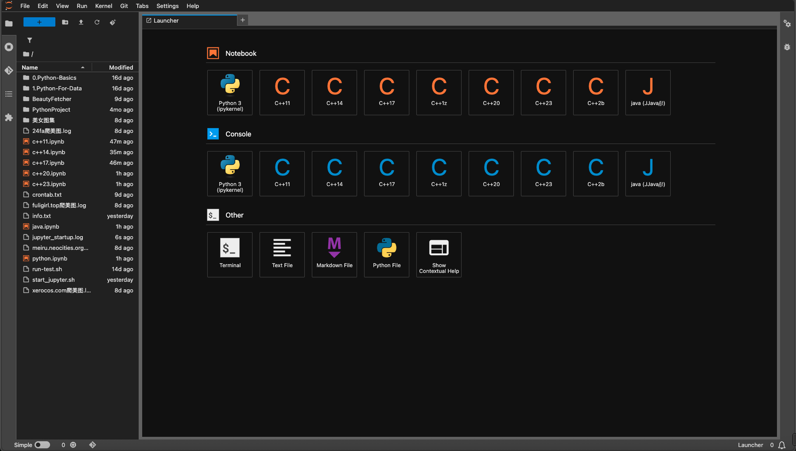

# docker-arch-pyenv-jupyter
pyenv 安装 jupyter notebook 封装特殊需求自用 python 测试容器 和 [docker-arch-miniforge-jupyter](https://github.com/469138946ba5fa/docker-arch-miniforge-jupyter) 项目一样，本项目通过 Docker 构建了一个多内核 Jupyter 环境，集成了 Python、C++ 和 Java 的内核。项目基于 pyenv 构建，并通过自动化脚本完成各项配置（如 Jupyter 自动配置、默认密码、终端、主题等）。



    
<a href="https://star-history.com/#469138946ba5fa/docker-arch-pyenv-jupyter&Date">
  <picture>
    <source media="(prefers-color-scheme: dark)" srcset="https://api.star-history.com/svg?repos=469138946ba5fa/docker-arch-pyenv-jupyter&type=Date&theme=dark" />
    <source media="(prefers-color-scheme: light)" srcset="https://api.star-history.com/svg?repos=469138946ba5fa/docker-arch-pyenv-jupyter&type=Date" />
    
  </picture>
</a>

## 目录结构

项目工作目录如下：

```plaintext
.
├── .env.amd64                 # Docker Compose 配置文件所需 amd64 环境，需要更名为 .env 使用
├── .env.arm64                 # Docker Compose 配置文件所需 arm64 环境，需要更名为 .env 使用
├── docker-compose.yml         # Docker Compose 配置文件，用于多容器编排（例如搭配其它服务时使用）
├── Dockerfile                 # 构建 Docker 镜像的说明文件
├── LICENSE                    # 许可协议文件
├── README.md                  # 本项目说明文档
├── images                     # 图像目录，包含 README.md 说明所需图像
├── scripts                    # 脚本目录，包含各项自动化安装和启动脚本
│   ├── analyze_size.sh        # 日志记录点，虽跳出三界外不在五行中，但却在道之内，为精简优化镜像提供参考
│   ├── clean.sh               # 清理构建产物或停止容器的脚本
│   ├── common.sh              # 通用日志、函数等辅助脚本
│   ├── init_system.sh         # 系统初始化脚本（例如配置 locale、环境变量等）
│   ├── install_cling.sh       # 编译安装 cling 内核的脚本，用于创建 cpp 支持环境
│   ├── install_jbang.sh       # 安装 jbang（用于 Java 工具链）的脚本
│   ├── install_jdk.sh         # 安装 JDK 环境的脚本
│   ├── install_jupyter.sh     # 安装并配置 Jupyter（包括内核、密码、默认终端/主题）的脚本
│   ├── install_pyenv.sh       # 安装 pyenv 的脚本，用于创建 python 环境
│   └── start_jupyter.sh       # 启动 Jupyter 服务的脚本
└── sources                    # 资源目录，包含预构建包和编译所需源码离线压缩包
    └── .gitkeep               # 仅作为一个占位文件，帮助 Git 跟踪空目录的存在
```

## 特点

- **多语言支持**  
  - Python 内核  
  - C++ 内核：默认提供 C++11、C++14、C++17、 C++1z C++20 C++2b 内核，手动修改配置后可以扩展支持 C++23。  
  - Java 内核：通过 jbang 与 Java（jdk 25）部署相应内核。

- **自动化配置**  
  - 自动生成 Jupyter 配置文件（`jupyter_server_config.py`、用户覆盖设置），设置默认密码、默认终端（`/bin/bash`）及黑暗主题。  
  - 脚本化安装与构建，确保在非交互式 Docker 环境中稳定运行。

- **数据科学支持**  
  包含多个常用数据科学和开发工具包（例如 numpy、pandas、jupyter_contrib_nbextensions 等），以满足开发与实验需求。

## 快速入门

### 通过 docker-compose 文件启动（如果你在 docker-compose.yml 中配置了服务）：

根据你的系统cpu架构选择正确的环境文件比如 .env.arm64 修改完善后，改名为 .env 以支持 docker-compose.yml 文件

```bash
docker-compose up -d
```

### 通过 docker 启动 Jupyter 服务

项目中通过 `tini` 执行 `start_jupyter.sh` 启动 Jupyter 服务。你可以直接进入容器后执行脚本，或在 Docker Compose 设置中指定此命令。启动后，服务默认监听 8888 端口。

例如，通过 docker 运行容器：

```bash
# 后台运行
# --rm 不能和 --restart=always 一起用，这是两个相反的命令
# 要么用 --rm 容器终止即删除
# 要么用 --restart=always 容器中断自动重启
docker run --restart=always \
  --name pyenv_jupyter_container \
  -it -d \
  -p 8888:8888 \
  -e JUPYTER_PASSWORD=123456 \
  -v "./jupyter/notebook:/notebook" \
  -v "./jupyter/.jupyter:/root/.jupyter" \
  ghcr.io/469138946ba5fa/docker-arch-pyenv-jupyter:latest \
  sh -c "tini -- /usr/local/bin/start_jupyter.sh"

# 查看日志
docker logs -f pyenv_jupyter_container

# 终止容器
docker stop pyenv_jupyter_container

# 删除容器
docker rm -fv pyenv_jupyter_container
```

### 访问 JupyterLab

在浏览器中打开 `http://localhost:8888`，按照 .env 配置文件中设置的密码或者 `123456` 登录。

### 密码修改
在浏览器中打开 `http://localhost:8888`，登陆，打开 `terminal` 终端
执行以下命令，并输入两次密码(不会显示字符)，重启容器完成密码修改
```bash
# 修改密码
jupyter notebook password
# 重启容器
docker-compose restart
```

### 测试内核

在 Jupyter Notebook 中，新建 Notebook 时，可以选择不同的内核（例如 Python Java C++11）。可将以下代码分别粘贴到不同内核 ipynb 页面的 cell 中测试：

- **Python 示例**

  ```python
  print('Hello, World! (Python)')
  word_str='af5ab649831964'
  word_str[::-1]
  ```

- **Java 示例**

  ```java
  System.out.println("Hello, World! (Java)");
  ```

在使用 C++ 内核时，需注意以下事项：

1. **清理内核以避免变量冲突报错**：
   - 频繁测试代码时，建议经常清理内核。
   - 重复执行同一个 cell 会导致变量名重复定义，因为 Jupyter 会存储这些变量。

2. **代码组织建议**：
   - 将不同功能的代码分离到不同的 cell 中按顺序执行。例如：
     - **头文件引用**：放入一个单独的 cell，仅需执行一次。
     - **变量定义**：放入一个单独的 cell，仅需执行一次。
     - **代码逻辑执行**：放入一个单独的 cell，可多次执行。

3. **使用独特变量名称**：尽量避免变量名重复，这是减少冲突的好习惯。

4. **解决报错的方法**：
   - 点击菜单中的 **"内核" -> "重新启动并清除输出"** 来清理之前定义的变量。
   - 然后重新运行需要的代码。

- **C++11 示例**

  ```cpp
  #include <iostream>
  #include <vector>
  #include <algorithm>

  std::vector<int> nums = {1, 2, 3, 4, 5};
  int sumOfSquares = 0;
  std::for_each(nums.begin(), nums.end(), [&sumOfSquares](int x) {
      sumOfSquares += x * x;
  });
  std::cout << "C++11: Sum of squares is " << sumOfSquares << std::endl;
  ```

- **C++14 示例**

  ```cpp
  #include <iostream>
  auto add = [](auto a, auto b) {
      return a + b;
  };
  std::cout << "C++14: 10 + 20 = " << add(10, 20) << std::endl;
  ```

- **C++17 示例**
  ```cpp
  #include <iostream>
  #include <tuple>

  std::tuple<int, double, std::string> data = {42, 3.14, "Hello C++17"};
  auto [num, pi, greeting] = data;
  std::cout << "C++17: " << num << ", " << pi << ", " << greeting << std::endl;
  ```

- **C++20 示例**

  ```cpp
  #include <iostream>
  #include <vector>
  #include <ranges>

  std::vector<int> v = {1, 2, 3, 4, 5};
  auto squares = v | std::views::transform([](int x) { return x * x; });
  std::cout << "C++20: Squares: ";
  for (auto s : squares) {
      std::cout << s << " ";
  }
  std::cout << std::endl;
  ```

- **C++23 示例**

  ```cpp
  #include <print>

  // 简单打印
  std::print("C++23: Welcome to C++23, {}!", "User");
  ```

## 已知问题与调试
- github 仓库 ghcr.io 推送一直不显示 docker 镜像标签信息☹️
- github 仓库 ghcr.io 推送 --output 导出器 type=oci-mediatypes=false 关闭OCI索引，然而失败了☹️
- 若 Jupyter 配置（密码、默认终端或主题）未生效，请检查容器启动日志中是否正确生成 `~/.jupyter` 下的配置文件。
- 容量太大，个人学习使用还可以，共享出来也少有人能用上，构建出这么大的镜像不如安装到本机

## 定制与扩展

- 如果你需要添加新的内核或者修改现有内核配置，请参考 `scripts/install_jupyter.sh` 中的自动化配置逻辑。  
- 更多配置项可参见 [Jupyter 官方文档](https://docs.jupyter.org/en/latest/index.html)，结合项目需求进行扩展。

## 构建 Docker 镜像

你可能需要一些前置条件，比如 docker compose buildx 环境的部署
稍微说一下吧，点到为止  
比如我的机器是 Ubuntu 24.04 LTS (GNU/Linux 6.8.0-57-generic aarch64)

  - **docker 部署过程如下：**

```bash
# 系统可以使用官方一键安装脚本 https://github.com/docker/docker-install
curl -fsSL https://test.docker.com -o test-docker.sh
sh test-docker.sh
# Manage Docker as a non-root user
## 非 root 用户需要加入到 docker 组才有权限使用
# Create the docker group
## 添加 docker 组
sudo groupadd docker
# Add your user to the docker group.
## 将当前用户加入到 docker 组权限
sudo usermod -aG docker ${USER}
# Log out and log back in so that your group membership is re-evaluated.
## 临时进入 docker 组测试，更好的方式是退出并重新登录测试
newgrp docker 
# Configure Docker to start on boot
# 启用 docker 开机自启动服务
sudo systemctl enable docker.service
sudo systemctl enable containerd.service
# satrt
# 开启 docker 服务，其实上一步就启用了
sudo systemctl start docker.service
sudo systemctl start containerd.service
# Verify that Docker Engine is installed correctly by running the hello-world image
# 测试 docker hello-world:latest 打印
docker run --rm hello-world:latest
```

  - **compose 部署更新过程如下：**

```bash
# GitHub 项目 URI
URI="docker/compose"

# 获取最新版本
VERSION=$(curl -sL "https://github.com/${URI}/releases" | grep -Eo '/releases/tag/[^"]+' | awk -F'/tag/' '{print $2}' | head -n 1)
echo "Latest version: ${VERSION}"

# 获取操作系统和架构信息
OS=$(uname -s)
ARCH=$(uname -m)

# 映射平台到官方命名
case "${OS}" in
  Linux)
    PLATFORM="linux"
    if [[ "${ARCH}" == "arm64" || "${ARCH}" == "aarch64" ]]; then
      ARCH="aarch64"
    elif [[ "${ARCH}" == "x86_64" ]]; then
      ARCH="x86_64"
    else
      echo "Unsupported architecture: ${ARCH}"
      echo 'should exit 1'
    fi
    ;;
  *)
    echo "Unsupported OS: ${OS}"
    echo 'should exit 1'
    ;;
esac

# 输出最终平台和架构
echo "Platform: ${PLATFORM}"
echo "Architecture: ${ARCH}"

# 拼接下载链接和校验码链接
TARGET_FILE="docker-compose-${PLATFORM}-${ARCH}"
SHA256_FILE="${TARGET_FILE}.sha256"
URI_DOWNLOAD="https://github.com/${URI}/releases/download/${VERSION}/${TARGET_FILE}"
URI_SHA256="https://github.com/${URI}/releases/download/${VERSION}/${SHA256_FILE}"
echo "Download URL: ${URI_DOWNLOAD}"
echo "SHA256 URL: ${URI_SHA256}"

# 检查文件是否存在
if [[ -f "/tmp/${TARGET_FILE}" ]]; then
  echo "File already exists: /tmp/${TARGET_FILE}"
  
  # 删除旧的 SHA256 文件（如果存在）
  if [[ -f "/tmp/${SHA256_FILE}" ]]; then
    echo "Removing old SHA256 file: /tmp/${SHA256_FILE}"
    rm -fv "/tmp/${SHA256_FILE}"
  fi

  # 下载新的 SHA256 文件
  echo "Downloading SHA256 file..."
  curl -L -C - --retry 3 --retry-delay 5 --progress-bar -o "/tmp/${SHA256_FILE}" "${URI_SHA256}"

  # 校验文件完整性
  # shasum 校验依赖 perl 可能 linux 系统需要手动安装
  echo "Verifying file integrity for /tmp/${TARGET_FILE}..."
  cd /tmp
  if ! shasum -a 256 -c "${SHA256_FILE}"; then
    log_warning "SHA256 checksum failed. Removing file and retrying..."
    rm -fv "/tmp/${TARGET_FILE}"
  else
    echo "File integrity verified successfully."
  fi
fi

# 如果文件不存在或之前校验失败
if [[ ! -f "/tmp/${TARGET_FILE}" ]]; then
  echo "Downloading file..."
  curl -L -C - --retry 3 --retry-delay 5 --progress-bar -o "/tmp/${TARGET_FILE}" "${URI_DOWNLOAD}"

  # 删除旧的 SHA256 文件并重新下载
  if [[ -f "/tmp/${SHA256_FILE}" ]]; then
    echo "Removing old SHA256 file: /tmp/${SHA256_FILE}"
    rm -fv "/tmp/${SHA256_FILE}"
  fi
  echo "Downloading SHA256 file..."
  curl -L --progress-bar -o "/tmp/${SHA256_FILE}" "${URI_SHA256}"

  # 校验完整性
  # shasum 校验依赖 perl 可能 linux 系统需要手动安装
  echo "Verifying file integrity for /tmp/${TARGET_FILE}..."
  cd /tmp
  if ! shasum -a 256 -c "${SHA256_FILE}"; then
    echo "Download failed: SHA256 checksum does not match."
    echo 'should exit 1'
  else
    echo "File integrity verified successfully."
  fi
fi

sudo mv -fv "/tmp/${TARGET_FILE}" /usr/local/bin/docker-compose
# Apply executable permissions to the binary
## 赋予执行权
sudo chmod -v +x /usr/local/bin/docker-compose
# create a symbolic link to /usr/libexec/docker/cli-plugins/
# 创建插件目录和软链接
sudo mkdir -pv /usr/libexec/docker/cli-plugins/
sudo ln -sfv /usr/local/bin/docker-compose /usr/libexec/docker/cli-plugins/docker-compose
# Test the installation.
## 测试版本打印
docker-compose version
docker compose version
```

  - **buildx 部署更新过程如下：**

```bash
# GitHub 项目 URI
URI="docker/buildx"

# 获取最新版本
VERSION=$(curl -sL "https://github.com/${URI}/releases" | grep -Eo '/releases/tag/[^"]+' | awk -F'/tag/' '{print $2}' | head -n 1)
echo "Latest version: ${VERSION}"

# 获取操作系统和架构信息
OS=$(uname -s)
ARCH=$(uname -m)

# 映射平台到官方命名
case "${OS}" in
  Linux)
    PLATFORM="linux"
    if [[ "${ARCH}" == "arm64" || "${ARCH}" == "aarch64" ]]; then
      ARCH="arm64"
    elif [[ "${ARCH}" == "x86_64" ]]; then
      ARCH="amd64"
    else
      echo "Unsupported architecture: ${ARCH}"
      echo 'should exit 1'
    fi
    ;;
  *)
    echo "Unsupported OS: ${OS}"
    echo 'should exit 1'
    ;;
esac

# 输出最终平台和架构
echo "Platform: ${PLATFORM}"
echo "Architecture: ${ARCH}"

# 拼接下载链接和校验码链接
TARGET_FILE="buildx-${VERSION}.${PLATFORM}-${ARCH}"
SHA256_FILE="${TARGET_FILE}.sbom.json"
URI_DOWNLOAD="https://github.com/${URI}/releases/download/${VERSION}/${TARGET_FILE}"
URI_SHA256="https://github.com/${URI}/releases/download/${VERSION}/${SHA256_FILE}"
echo "Download URL: ${URI_DOWNLOAD}"
echo "SHA256 URL: ${URI_SHA256}"

# 检查文件是否存在
if [[ -f "/tmp/${TARGET_FILE}" ]]; then
  echo "File already exists: /tmp/${TARGET_FILE}"
  
  # 删除旧的 SHA256 文件（如果存在）
  if [[ -f "/tmp/${SHA256_FILE}" ]]; then
    echo "Removing old SHA256 file: /tmp/${SHA256_FILE}"
    rm -fv "/tmp/${SHA256_FILE}"
  fi

  # 下载新的 SHA256 文件
  echo "Downloading SHA256 file..."
  curl -L -C - --retry 3 --retry-delay 5 --progress-bar -o "/tmp/${SHA256_FILE}" "${URI_SHA256}"
  # 提取校验码
  CHECKSUM=$(cat "/tmp/${SHA256_FILE}" | jq -r --arg filename "${TARGET_FILE}" '.subject[] | select(.name == $filename) | .digest.sha256')
  # 将校验码写入源文件
  echo "${CHECKSUM} *${TARGET_FILE}" > "/tmp/${SHA256_FILE}"
  echo "校验码 ${CHECKSUM} 已写入文件: /tmp/${SHA256_FILE}"

  # 校验文件完整性
  # shasum 校验依赖 perl 可能 linux 系统需要手动安装
  echo "Verifying file integrity for /tmp/${TARGET_FILE}..."
  cd /tmp
  if ! shasum -a 256 -c "${SHA256_FILE}"; then
    log_warning "SHA256 checksum failed. Removing file and retrying..."
    rm -fv "/tmp/${TARGET_FILE}"
  else
    echo "File integrity verified successfully."
  fi
fi

# 如果文件不存在或之前校验失败
if [[ ! -f "/tmp/${TARGET_FILE}" ]]; then
  echo "Downloading file..."
  curl -L -C - --retry 3 --retry-delay 5 --progress-bar -o "/tmp/${TARGET_FILE}" "${URI_DOWNLOAD}"

  # 删除旧的 SHA256 文件并重新下载
  if [[ -f "/tmp/${SHA256_FILE}" ]]; then
    echo "Removing old SHA256 file: /tmp/${SHA256_FILE}"
    rm -fv "/tmp/${SHA256_FILE}"
  fi
  echo "Downloading SHA256 file..."
  curl -L --progress-bar -o "/tmp/${SHA256_FILE}" "${URI_SHA256}"
  # 提取校验码
  CHECKSUM=$(cat "/tmp/${SHA256_FILE}" | jq -r --arg filename "${TARGET_FILE}" '.subject[] | select(.name == $filename) | .digest.sha256')
  # 将校验码写入源文件
  echo "${CHECKSUM} *${TARGET_FILE}" > "/tmp/${SHA256_FILE}"
  echo "校验码 ${CHECKSUM} 已写入文件: /tmp/${SHA256_FILE}"

  # 校验完整性
  # shasum 校验依赖 perl 可能 linux 系统需要手动安装
  echo "Verifying file integrity for /tmp/${TARGET_FILE}..."
  cd /tmp
  if ! shasum -a 256 -c "${SHA256_FILE}"; then
    echo "Download failed: SHA256 checksum does not match."
    echo 'should exit 1'
  else
    echo "File integrity verified successfully."
  fi
fi

sudo mv -fv "/tmp/${TARGET_FILE}" /usr/local/bin/docker-buildx
# Apply executable permissions to the binary
## 赋予执行权
sudo chmod -v +x /usr/local/bin/docker-buildx
# create a symbolic link to /usr/libexec/docker/cli-plugins/
# 创建插件目录和软链接
sudo mkdir -pv /usr/libexec/docker/cli-plugins/
sudo ln -sfv /usr/local/bin/docker-buildx /usr/libexec/docker/cli-plugins/docker-buildx
## 测试版本打印
docker-buildx version
docker buildx version
```

  - **scout-cli 部署更新过程如下：**
  Docker Scout 是一组集成到 Docker 用户界面和命令行界面 （CLI） 中的软件供应链功能。这些功能提供了对容器映像的结构和安全性的全面可见性。 此存储库包含 CLI 插件的可安装二进制文件。
  ```bash
mkdir -pv $HOME/.docker
curl -sSfL https://raw.githubusercontent.com/docker/scout-cli/main/install.sh | sh -s --
  ```
  1. scout-cli 使用例子，登陆docker账号，其中 `469138946ba5fa` 换成你自己的
  ```bash
docker login -u 469138946ba5fa
  ```
  2. 注册到已知的组织单位，如果你有的话，没有可以不执行
  ```bash
docker scout enroll ORG_NAME
  ```
  3. 快速查看镜像
  ```bash
docker scout quickview hello-world:latest
  ```
  会返回以下信息，其中漏洞等级含义如下
  | CVSS分数    | 漏洞等级   |
  |------------|--------------|
  | 9.0 – 10.0 | **关键** (C) |
  | 7.0 – 8.9  | **高** (H)   |
  | 4.0 – 6.9  | **中** (M)   |
  | 0.1 – 3.9  | **低** (L)   |
  ```plaintext
    ✓ Image stored for indexing
    ✓ Indexed 0 packages
    ✓ 1 exception obtained

    i Base image was auto-detected. To get more accurate results, build images with max-mode provenance attestations.
      Review docs.docker.com ↗ for more information.

  Target   │  hello-world:latest  │    0C     0H     0M     0L   
    digest │  1b44b5a3e06a        │                              

What's next:
    Include policy results in your quickview by supplying an organization → docker scout quickview hello-world:latest --org <organization>
  ```
  4. 检测镜像漏洞
  ```bash
docker scout cves --only-package hello-world:latest
  ```
  会返回以下内容，
  ```plaintext
    ✓ SBOM of image already cached, 1183 packages indexed
    ✓ No vulnerable package detected


## Overview

                    │       Analyzed Image         
────────────────────┼──────────────────────────────
  Target            │                              
    digest          │  4fbad79ded98                
    platform        │ linux/amd64                  
    vulnerabilities │    0C     0H     0M     0L   
    size            │ 1.1 GB                       
    packages        │ 0                            


## Packages and Vulnerabilities

  No vulnerable packages detected
  ```
  5. 比较两个镜像的安全性与依赖差异，比如 hello-world 不同版本间的比较(`docker scout compare`是实验性功能，未来会有变化)
  ```bash
# pull 两个不同版本 
docker pull hello-world:latest
docker pull hello-world:nanoserver:1709
# 比较
docker scout compare --to hello-world:latest hello-world:nanoserver1709
  ```
  会返回以下内容，
  ```plaintext
    ! 'docker scout compare' is experimental and its behaviour might change in the future
    ✓ Pulled
    ✓ Image stored for indexing
    ✓ Indexed 1 packages
    ✓ SBOM of image already cached, 0 packages indexed
    ✓ 1 exception obtained
    ✓ 1 exception obtained
  
  
  ## Overview
  
                      │        Analyzed Image        │      Comparison Image        
  ────────────────────┼──────────────────────────────┼──────────────────────────────
    Target            │  hello-world:nanoserver1709  │  hello-world:latest          
      digest          │  786a29974908                │  1b44b5a3e06a                
      tag             │  nanoserver1709              │  latest                      
      platform        │ windows/amd64                │ linux/amd64                  
      vulnerabilities │    0C     0H     0M     0L   │    0C     0H     0M     0L   
                      │                              │                              
      size            │ 99 MB (+99 MB)               │ 2.5 kB                       
      packages        │ 1 (+1)                       │ 0                            
                      │                              │                              
  
  
  ## Environment Variables
  
  
    - PATH=/usr/local/sbin:/usr/local/bin:/usr/sbin:/usr/bin:/sbin:/bin
  
  
  
  ## Packages and Vulnerabilities
  
  
    +    1 packages added
  
  
  
  
     Package              Type   Version        Compared Version  
  
  +  runscripthelper.exe  nuget  10.0.16299.15
  ```

  - **docker buildx build 在项目目录下执行构建镜像具体流程命令 ：**

```bash
# docker proxy pull
## 配置 docker 代理，比如 http://192.168.255.253:7890
sudo mkdir -pv /etc/systemd/system/docker.service.d
cat << '469138946ba5fa' | sudo tee /etc/systemd/system/docker.service.d/http-proxy.conf
[Service]
Environment="HTTP_PROXY=http://192.168.255.253:7890"
Environment="HTTPS_PROXY=http://192.168.255.253:7890"
Environment="NO_PROXY=localhost,127.0.0.1,192.168.255.0/24"
469138946ba5fa
sudo systemctl daemon-reload
sudo systemctl restart docker
sudo systemctl show --property=Environment docker

# docker login & config
## 使用 github 具有上传下载镜像权限 [write:packages(read:packages)] 的 token 登陆 github 并预配置用户和目录参数
echo '请输入具有上传下载镜像权限 [write:packages(read:packages)] 的 github token (不会显示输入内容):' ; read -sr GITHUB_TOKEN
echo '请输入 github 用户名(为空则默认是 469138946ba5fa ):' ; read -r USERNAME
echo '请输入你的 github 镜像存储源(为空则默认是 ghcr.io ):' ; read -r DOCKER_DOMAIN
echo '请输入 docker 项目存放的父目录(为空则默认目录 /media/psf/KingStonSSD1T/docker-workspace ):' ; read -r CUSTOM_DIR
echo '请输入你的 docker 项目名(为空则默认是我的仓库名即 docker-arch-pyenv-jupyter ):' ; read -r REPO
echo '请输入你的 docker buildx 构建可能需要的大缓存存储目录(为空则默认目录 /media/psf/KingStonSSD1T/docker_buildx.cache ):' ; read -r BUILDX_CACHE

## 执行登陆和变量赋值解除
USERNAME=${USERNAME:-469138946ba5fa}
DOCKER_DOMAIN=${DOCKER_DOMAIN:-ghcr.io}
echo ${GITHUB_TOKEN} | docker login ${DOCKER_DOMAIN} -u ${USERNAME} --password-stdin ; unset GITHUB_TOKEN
CUSTOM_DIR=${CUSTOM_DIR:-'/media/psf/KingStonSSD1T/docker-workspace'}
REPO=${REPO:-docker-arch-pyenv-jupyter}
BUILDX_CACHE=${BUILDX_CACHE:-'/media/psf/KingStonSSD1T/docker_buildx.cache'}

## 创建缓存目录和新缓存目录
mkdir -pv ${BUILDX_CACHE}
mkdir -pv ${BUILDX_CACHE}-new
echo ${USERNAME}
echo ${DOCKER_DOMAIN}
echo ${CUSTOM_DIR}/${REPO}
echo ${BUILDX_CACHE}
echo ${BUILDX_CACHE}-new

## 进入到项目目录
cd ${CUSTOM_DIR}/${REPO}

# stop and remove containerd
## 停止并移除当前运行容器
docker-compose stop
docker-compose rm -fv

# delete image tag
## 删除当前镜像，如果需要可以解除注释粘贴执行
#docker rmi ${DOCKER_DOMAIN}/${USERNAME}/${REPO}:latest

# All emulators:
## 多架构跨平台环境虚拟
docker run --privileged --rm tonistiigi/binfmt:master --install all
# Show currently supported architectures and installed emulators
docker run --privileged --rm tonistiigi/binfmt:master

# docker buildx 
## 使用 docker buildx 构建单/多架构镜像
# buildx create
## 停用删除已有的 builder
docker-buildx stop ${REPO}
docker-buildx rm -f ${REPO}
## 创建 buildx 构建节点并启用查看信息
#docker-buildx create --use
docker-buildx create --name ${REPO} --use
## 或者和上一步骤二选一如果最终测试不好也可以换用代理模式比如 192.168.255.253:7890 创建 buildx 构建节点并启用
docker buildx create --use --name ${REPO} \
  --driver docker-container \
  --driver-opt env.http_proxy=http://192.168.255.253:7890 \
  --driver-opt env.https_proxy=http://192.168.255.253:7890

## 实例启动后查看 builder 信息
docker-buildx inspect --bootstrap

#  说明：
#  --platform linux/arm64/v8,linux/amd64 表示构建多个平台的镜像。
#  --tag 参数根据你自己的环境变量（例如 DOCKER_DOMAIN、USERNAME、REPO）设置镜像名称。
#  --no-cache 选项来避免使用过多的缓存，不要与 --cache-from 和 --cache-to 合用
#  --cache-from 从 ${BUILDX_CACHE} 目录中加载缓存数据，加速构建。
#  --cache-to 将新生成的缓存数据写入到 ${BUILDX_CACHE}-new 目录中。
#  --label 添加单镜像标签应该和 Dockerfile 中的 LABEL 等效
#  --load 表示将构建完成的镜像加载到 Docker 本地镜像库中（对于跨平台构建，注意在某些情况下可能只能加载当前体系结构的镜像）。
#  --push 表示将构建完成的镜像推送到 Docker 远端镜像库中 
#  --output 导出器以下是type参数信息
#    type=image 导出类型为镜像
#    name=ghcr.io/469138946ba5fa/docker-arch-test:latest 镜像名
#    compression=zstd 压缩类型 zstd 也支持 gzip 和 estargz
#    compression-level=22 设置 zstd 压缩级别为 22 ，gzip 和 estargz 的范围是 0-9 ， zstd 的范围是 0-22
#    force-compression=true 强制重压缩
#  最近发现对于多架构镜像需要额外在 --output 中配置多架构标签属性 --label 仅适用于单架构情况 https://docs.github.com/en/packages/working-with-a-github-packages-registry/working-with-the-container-registry#adding-a-description-to-multi-arch-images
#  --output 
#    annotation-index.org.opencontainers.image.description='' 多架构镜像注释标签
#    annotation-index.org.opencontainers.image.title='' 多架构镜像标题标签
#    annotation-index.org.opencontainers.image.version='' 多架构镜像版本标签
#    annotation-index.org.opencontainers.image.authors='' 多架构镜像作者标签
#    annotation-index.org.opencontainers.image.source='' 多架构镜像关联仓库标签
#    annotation-index.org.opencontainers.image.licenses='' 多架构镜像协议标签
#  最近发现云端镜像仓库有 unknown/unknown 未识别架构的问题，如下方案可以规避云端仓库 https://github.com/docker/buildx/issues/1964#issuecomment-1644634461
#  --output 导出器 type=oci-mediatypes=false 关闭OCI索引，然而失败了☹️，unknown/unknown 显示问题存在
#  --provenance=false 设置为不生成来源信息，但禁用 provenance 信息，意味着你失去了有关构建过程的详细记录和签名。这对追踪镜像的安全性和来源可能会有一些影响，可以解决 unknown/unknown 显示问题
#  参考 https://docs.docker.com/build/building/variables/#buildx_no_default_attestations
#  export BUILDX_NO_DEFAULT_ATTESTATIONS=1 添加环境变量禁用来源证明应该和 --provenance=false 等效，也可以解决 unknown/unknown 显示问题
#  综上，我觉得 unknown/unknown 也可以接受，就这样吧

# buildx build load
## 单架构本地存储，比如 linux/arm64/v8 ，压缩生成镜像
docker buildx build \
  --platform linux/arm64/v8 \
  --cache-from type=local,src=${BUILDX_CACHE} \
  --cache-to type=local,dest=${BUILDX_CACHE}-new,mode=max \
  --output type=image,name=${DOCKER_DOMAIN}/${USERNAME}/${REPO}:latest,compression=zstd,compression-level=22,force-compression=true \
  --tag ${DOCKER_DOMAIN}/${USERNAME}/${REPO}:latest \
  --load .

# docker-compose test
## docker-compose 运行测试
docker-compose stop
docker-compose rm -fv
docker-compose up -d --force-recreate
## 容器日志 ctrl+c 退出
docker-compose logs -f
## 容器状态监控 ctrl+c 退出
docker-compose stats

# buildx build push
## 多架构上传仓库，比如 linux/arm64/v8,linux/amd64，去除oci索引，防止 unknown/unknown
## 正常构建镜像会很大，但是时间很短，上传会浪费大量带宽
# buildx build push
## 多架构上传仓库，比如 linux/arm64/v8,linux/amd64
## 正常构建镜像会很大，但是时间很短，上传会浪费大量带宽
docker buildx build \
  --platform linux/arm64/v8,linux/amd64 \
  --cache-from type=local,src=${BUILDX_CACHE} \
  --cache-to type=local,dest=${BUILDX_CACHE}-new,mode=max \
  --output type=image,name=${DOCKER_DOMAIN}/${USERNAME}/${REPO}:latest,\
annotation-index.org.opencontainers.image.description='pyenv 安装 jupyter notebook 封装特殊需求自用 python 测试容器，支持 amd64 和 arm64/v8 架构.',\
annotation-index.org.opencontainers.image.title='Pyenv Jupyter',\
annotation-index.org.opencontainers.image.version='1.0.0',\
annotation-index.org.opencontainers.image.authors='469138946ba5fa <af5ab649831964@gmail.com>',\
annotation-index.org.opencontainers.image.source='https://github.com/469138946ba5fa/docker-arch-pyenv-jupyter',\
annotation-index.org.opencontainers.image.licenses='MIT' \
  --annotation org.opencontainers.image.description='pyenv 安装 jupyter notebook 封装特殊需求自用 python 测试容器，支持 amd64 和 arm64/v8 架构.' \
  --annotation org.opencontainers.image.title='Pyenv Jupyter' \
  --annotation org.opencontainers.image.version='1.0.0' \
  --annotation org.opencontainers.image.authors='469138946ba5fa <af5ab649831964@gmail.com>' \
  --annotation org.opencontainers.image.source='https://github.com/469138946ba5fa/docker-arch-pyenv-jupyter' \
  --annotation org.opencontainers.image.licenses='MIT' \
  --push .

## 或者多架构上传仓库，比如 linux/arm64/v8,linux/amd64，压缩
## 但压缩会意味着浪费更多的时间，但是也许会节省带宽，然而我并不清楚压缩和正常构建之间的关系
docker buildx build \
  --platform linux/arm64/v8,linux/amd64 \
  --cache-from type=local,src=${BUILDX_CACHE} \
  --cache-to type=local,dest=${BUILDX_CACHE}-new,mode=max \
  --output type=image,name=${DOCKER_DOMAIN}/${USERNAME}/${REPO}:latest,compression=zstd,compression-level=22,force-compression=true,\
annotation-index.org.opencontainers.image.description='pyenv 安装 jupyter notebook 封装特殊需求自用 python 测试容器，支持 amd64 和 arm64/v8 架构.',\
annotation-index.org.opencontainers.image.title='Pyenv Jupyter',\
annotation-index.org.opencontainers.image.version='1.0.0',\
annotation-index.org.opencontainers.image.authors='469138946ba5fa <af5ab649831964@gmail.com>',\
annotation-index.org.opencontainers.image.source='https://github.com/469138946ba5fa/docker-arch-pyenv-jupyter',\
annotation-index.org.opencontainers.image.licenses='MIT' \
  --annotation org.opencontainers.image.description='pyenv 安装 jupyter notebook 封装特殊需求自用 python 测试容器，支持 amd64 和 arm64/v8 架构.' \
  --annotation org.opencontainers.image.title='Pyenv Jupyter' \
  --annotation org.opencontainers.image.version='1.0.0' \
  --annotation org.opencontainers.image.authors='469138946ba5fa <af5ab649831964@gmail.com>' \
  --annotation org.opencontainers.image.source='https://github.com/469138946ba5fa/docker-arch-pyenv-jupyter' \
  --annotation org.opencontainers.image.licenses='MIT' \
  --push .

## 或者多架构上传仓库，比如 linux/arm64/v8,linux/amd64，压缩，不生成镜像来源，防止 unknown/unknown
## 使用 export BUILDX_NO_DEFAULT_ATTESTATIONS=1 或 --provenance=false 禁用来源信息，意味着你失去了有关构建过程的详细记录和签名。这对追踪镜像的安全性和来源可能会有一些影响。
#export BUILDX_NO_DEFAULT_ATTESTATIONS=1
docker buildx build \
  --platform linux/arm64/v8,linux/amd64 \
  --cache-from type=local,src=${BUILDX_CACHE} \
  --cache-to type=local,dest=${BUILDX_CACHE}-new,mode=max \
  --output type=image,name=${DOCKER_DOMAIN}/${USERNAME}/${REPO}:latest,compression=zstd,compression-level=22,force-compression=true,\
annotation-index.org.opencontainers.image.description='pyenv 安装 jupyter notebook 封装特殊需求自用 python 测试容器，支持 amd64 和 arm64/v8 架构.',\
annotation-index.org.opencontainers.image.title='Pyenv Jupyter',\
annotation-index.org.opencontainers.image.version='1.0.0',\
annotation-index.org.opencontainers.image.authors='469138946ba5fa <af5ab649831964@gmail.com>',\
annotation-index.org.opencontainers.image.source='https://github.com/469138946ba5fa/docker-arch-pyenv-jupyter',\
annotation-index.org.opencontainers.image.licenses='MIT' \
  --annotation org.opencontainers.image.description='pyenv 安装 jupyter notebook 封装特殊需求自用 python 测试容器，支持 amd64 和 arm64/v8 架构.' \
  --annotation org.opencontainers.image.title='Pyenv Jupyter' \
  --annotation org.opencontainers.image.version='1.0.0' \
  --annotation org.opencontainers.image.authors='469138946ba5fa <af5ab649831964@gmail.com>' \
  --annotation org.opencontainers.image.source='https://github.com/469138946ba5fa/docker-arch-pyenv-jupyter' \
  --annotation org.opencontainers.image.licenses='MIT' \
  --provenance=false \
  --push .
#unset BUILDX_NO_DEFAULT_ATTESTATIONS

# 如果你以上方法都尝试了，经常失败，那说明网络真的很不好，可以尝试一个一个架构的构建并传输到云存储空间，可以使用以下方法
# 无压缩：push 的层更小、更快，失败重传代价低。
# 分架构 push：如果某个架构 push 失败，只需重试那一个，不会浪费几个小时重传整个 multi-arch。
# 注意这个方法会让你的latest丧失镜像注释标签
# 构建并推送 amd64
docker buildx build \
  --platform linux/amd64 \
  --cache-from type=local,src=${BUILDX_CACHE} \
  --cache-to type=local,dest=${BUILDX_CACHE}-new,mode=max \
  --output type=image,name=${DOCKER_DOMAIN}/${USERNAME}/${REPO}:amd64 \
  --tag ${DOCKER_DOMAIN}/${USERNAME}/${REPO}:amd64 \
  --annotation org.opencontainers.image.description='pyenv 安装 jupyter notebook 封装特殊需求自用 python 测试容器，支持 amd64 和 arm64/v8 架构.' \
  --annotation org.opencontainers.image.title='Pyenv Jupyter' \
  --annotation org.opencontainers.image.version='1.0.0' \
  --annotation org.opencontainers.image.authors='469138946ba5fa <af5ab649831964@gmail.com>' \
  --annotation org.opencontainers.image.source='https://github.com/469138946ba5fa/docker-arch-pyenv-jupyter' \
  --annotation org.opencontainers.image.licenses='MIT' \
  --provenance=false \
  --push .

# 构建并推送 arm64
docker buildx build \
  --platform linux/arm64/v8 \
  --cache-from type=local,src=${BUILDX_CACHE} \
  --cache-to type=local,dest=${BUILDX_CACHE}-new,mode=max \
  --output type=image,name=${DOCKER_DOMAIN}/${USERNAME}/${REPO}:arm64 \
  --tag ${DOCKER_DOMAIN}/${USERNAME}/${REPO}:arm64 \
  --annotation org.opencontainers.image.description='pyenv 安装 jupyter notebook 封装特殊需求自用 python 测试容器，支持 amd64 和 arm64/v8 架构.' \
  --annotation org.opencontainers.image.title='Pyenv Jupyter' \
  --annotation org.opencontainers.image.version='1.0.0' \
  --annotation org.opencontainers.image.authors='469138946ba5fa <af5ab649831964@gmail.com>' \
  --annotation org.opencontainers.image.source='https://github.com/469138946ba5fa/docker-arch-pyenv-jupyter' \
  --annotation org.opencontainers.image.licenses='MIT' \
  --provenance=false \
  --push .

# 合并推送 manifest
# manifest 合并：最终依然得到一个 :latest 多架构镜像，使用体验不变。
docker manifest create ${DOCKER_DOMAIN}/${USERNAME}/${REPO}:latest \
  --amend ${DOCKER_DOMAIN}/${USERNAME}/${REPO}:amd64 \
  --amend ${DOCKER_DOMAIN}/${USERNAME}/${REPO}:arm64
docker manifest push ${DOCKER_DOMAIN}/${USERNAME}/${REPO}:latest

# 查看 Docker 镜像元数据信息
docker inspect ${DOCKER_DOMAIN}/${USERNAME}/${REPO}:latest
# 查看 Docker 镜像清单（Manifest）。JSON 格式 Docker 镜像清单包含了有关镜像的元数据，包括层（layers）、架构（architecture）、操作系统（OS）、标签（tags）等信息
docker manifest inspect ${DOCKER_DOMAIN}/${USERNAME}/${REPO}:latest
# 启用调试模式后，命令会输出更多的详细信息，包括 Docker 连接的网络请求、API 调用等
docker --debug manifest inspect ${DOCKER_DOMAIN}/${USERNAME}/${REPO}:latest

# delete buildx cache dir
## 删除 docker buildx 所使用的大存储缓存目录，你也可以留着
rm -frv ${BUILDX_CACHE}

# create new buildx cache dir
## 使用  docker buildx 新的缓存替换旧缓存
mv -fv ${BUILDX_CACHE}-new ${BUILDX_CACHE}
mkdir -pv  ${BUILDX_CACHE}-new


## 清理 buildx 构建缓存。以及清理构建新镜像所产生的 <none> 标签老镜像
docker builder prune -af
docker rmi $(docker images -qaf dangling=true)

# docker build clean
## 清理所有停止的容器
#docker container prune -f
## 清理未使用的卷
#docker volume prune -af
## 清理未使用的镜像
#docker image prune -af
## 清理不使用的网络
#docker network prune -f
## 清理不使用的卷
#docker volume prune -af
## 清理所有不需要的数据: 如果想要彻底清理所有未使用的镜像、容器、网络和卷，可以使用
#docker system prune --all --volumes -af

# buildx remove other node
## 清理 buildx 不使用的节点，你也可以留着
docker-buildx use default
docker-buildx ls
#docker-buildx rm -f --all-inactive
#docker-buildx rm -f $(docker-buildx ls --format '{{.Builder.Name}}')
docker-buildx stop ${REPO}
docker-buildx rm -f ${REPO}
docker-buildx ls
```

## 获取跨平台的预编译安装包
利用 docker 环境构建跨平台的预编译安装包流程：

  - **其实就是 script/init_system.sh script/install_cling.sh 和 script/start_jupyter.sh 脚本中从源码编译的部分代码组合实现**
  - **第一阶段：创建多架构容器，配置多容器跨平台支持环境，多架构容器测试编译流程防止产生错误**
```bash
# All emulators:
## 多架构跨平台环境虚拟
docker run --privileged --rm tonistiigi/binfmt:master --install all
# Show currently supported architectures and installed emulators
docker run --privileged --rm tonistiigi/binfmt:master

# 注意如果报错 exec /usr/bin/bash: no such file or directory 如果你是 ubuntu/debian 或其他 linux 系统，你可能还需要想办法安装 qemu 不然可能系统运行不同架构容器可能
sudo apt install -y qemu-user-static
# 然后重新注册尝试运行不同架构容器
docker run --privileged --rm tonistiigi/binfmt:master --install all

# arm64/v8 架构，最好是在同架构中，这样编译后的运行实际效果最为真实，比如树莓派，macmini m4
docker run --rm \
  --name "test-arm64" \
  --platform "linux/arm64/v8" \
  --memory="8g" \
  -p "8888:8888" \
  -it ubuntu:rolling bash

# 或 amd64 架构，最好是在同架构中，这样编译后的运行实际效果最为真实，比如gmktec m6, EVO-T1 AI Mini PC
docker run --rm \
  --name "test-amd64" \
  --platform "linux/amd64" \
  --memory="8g" \
  -p "8888:8888" \
  -it ubuntu:rolling bash
```

  - **🧹 第二阶段：容器内配置 pyenv 并编译 python 安装 jupyter ，clone root-project/llvm-project 和 root-project/cling 源码编译测试 cling**

```bash
# 环境变量
export DEBIAN_FRONTEND=noninteractive \
  PIP_CHANNELS='https://pypi.org/simple' \
  PIP_CHANNELS="${PIP_CHANNELS:-https://pypi.org/simple}" \
  # 指定 cling 的 python 版本
  # 获取pyenv版本
  # 为空则返回最新稳定版，如 3.13.3
  # --latest-alpha 返回最新 alpha，如 3.14.0a7t
  # --latest-dev 返回最新 dev，如 3.14t-dev
  # --latest-t 返回最新 t，如 3.13.3t
  # 3.13.2t 如果存在就返回它，不存在则返回最新稳定版
  # 3.99.9 不存在，返回 fallback 稳定版
  PY_VERSION=3.12.10 \
  PY_ENV=py${PY_VERSION} \
  # 初始化 pyenv 环境
  PYENV_ROOT="${HOME}/.pyenv" \
  PATH="${PYENV_ROOT}/bin:${PYENV_ROOT}/versions/${PY_ENV}/bin:${PATH}" \
  SRC_DIR="/tmp" \
  INSTALL_PREFIX="/usr/local" \
  KERNEL_DIR="${INSTALL_PREFIX}/share/cling/Jupyter" \
  BUILD_DIR="${INSTALL_PREFIX}/share/cling/build" \
  # 默认不设置则用1/3的线程，防止系统崩溃大哭
  CORENUM=4 \
  CORENUM=${CORENUM:-$(($(nproc)/3))}

# 所需系统软件包列表（基础系统工具和常用工具）
packages=(
  apt-transport-https  # 允许 APT 使用 HTTPS 协议访问软件仓库，提高传输安全性
  ca-certificates      # 根证书包，用于验证 SSL/TLS 链接，确保 HTTPS 通信安全
  git               # 分布式版本控制系统，用于代码管理和拉取远程仓库
  build-essential   # 一组构建工具（如 gcc、make 等），用于编译编译 C/C++ 等语言的代码
  # 构建工具链核心三板斧
  cmake             # 读取源码中的 CMakeLists.txt 文件（类似于 Makefile）判断系统、依赖、编译器，生成真正用来编译的构建脚本
  ninja-build       # 吃 cmake 生成的 .ninja 文件来执行实际的编译任务，小巧又超级快的构建工具，比 make 快很多，适合大型 C++ 工程（比如 LLVM 和 Cling）
  curl              # 命令行 HTTP 请求工具，用于获取 URL 内容和进行网络调试
  # 安全 & 加密相关
  libssl-dev	      # 支持 ssl 模块，用于 HTTPS、TLS 加密，依赖 OpenSSL。
  libffi-dev	      # 提供调用外部 C 函数的能力，支持 ctypes 和某些 FFI 模块。
  libxmlsec1-dev	  # 用于 XML 加密、签名验证等高级安全操作（较少用，某些包可能用到）。
  # 压缩 & 解压相关
  zlib1g-dev	      # 用于 zlib 模块，支持 .gz 格式压缩解压。
  libbz2-dev	      # 用于 bz2 模块，支持 .bz2 文件。
  liblzma-dev	      # 支持 .xz、.lzma 格式压缩（lzma 模块）。
  xz-utils	          # 提供 xz 命令行工具，也用于支持 lzma。
  # 数据库 & 存储支持
  libsqlite3-dev	  # 支持 sqlite3 模块，这是 Python 自带的轻量数据库。
  # 终端与交互支持
  libreadline-dev	  # 支持命令行输入历史、编辑等功能（REPL 中常用）。
  libncursesw5-dev	  # 提供彩色终端、光标控制支持（如 curses 模块）。
  # 图形界面支持（用于 tkinter）
  tk-dev	          # 支持 GUI 模块 tkinter，依赖 Tcl/Tk。
  # XML 支持
  libxml2-dev	      # 支持处理 XML 文档的 xml.etree.ElementTree、xml.dom 等模块。
)

# 更新 apt 并安装所需软件包
apt update

# 循环安装各软件包
for pkg in "${packages[@]}"; do
  echo "Installing package: ${pkg}"
  apt -y install --no-install-recommends "${pkg}" || { echo "Failed to install ${pkg} Should exit 1"; }
done
ln -fsv /usr/share/zoneinfo/Asia/Shanghai /etc/localtime
dpkg-reconfigure -f noninteractive tzdata
echo "System initialization completed."

# 安装 pyenv
curl https://pyenv.run | bash

# 更新 pyenv
cd ${PYENV_ROOT}/ && git pull && cd ${SRC_DIR}

echo "pyenv setup is complete."
pyenv --version

# 初始化 pyenv 环境
eval "$(pyenv init -)"
eval "$(pyenv virtualenv-init -)"

# 获取pyenv版本
# resolve_python_version	返回最新稳定版，如 3.13.3
# resolve_python_version --latest-alpha	返回最新 alpha，如 3.14.0a7t
# resolve_python_version --latest-dev	返回最新 dev，如 3.14t-dev
# resolve_python_version --latest-t	返回最新 t，如 3.13.3t
# resolve_python_version 3.13.2t	如果存在就返回它，不存在则返回最新稳定版
# resolve_python_version 3.99.9	不存在，返回 fallback 稳定版
resolve_python_version() {
  local version=""
  local mode="stable"

  # 参数解析
  for arg in "$@"; do
    case "${arg}" in
      --latest-dev) mode="dev" ;;
      --latest-alpha) mode="alpha" ;;
      --latest-t) mode="t" ;;
      --*) echo "Unknown option: ${arg}" >&2; return 1 ;;
      *) version="${arg}" ;;  # 不是 -- 开头就是版本
    esac
  done

  local list=$(pyenv install --list 2>/dev/null | sed 's/^[ \t]*//' | grep -E '^2|^3\.')

  # 如果用户指定了版本，且存在，直接返回该版本
  if [[ -n "${version}" ]] && echo "${list}" | grep -qx "${version}"; then
    echo "${version}"
    return 0
  fi

  # 回退逻辑
  local fallback=""
  # 过滤算法
  case "${mode}" in
    alpha)
      fallback=$(echo "${list}" | grep -E '\.[0-9]+a[0-9]+?$' | tail -n1)
      ;;
    dev)
      fallback=$(echo "${list}" | grep -E 'dev$' | tail -n1)
      ;;
    t)
      fallback=$(echo "${list}" | grep -E 't$' | tail -n1)
      ;;
    stable)
      fallback=$(echo "${list}" | grep -vE 'dev$|t$|a' | tail -n1)
      ;;
  esac

  echo "${fallback}"
}

# 编译指定版本 python
pyenv install -v -f $(resolve_python_version ${PY_VERSION})
# 刷新
pyenv rehash
# 当前版本检查
pyenv version
pyenv versions

# 获取安装好的 python 版本
#PY_VERSION=$(pyenv versions | sed 's/^[ \t]*//')
pyenv global ${PY_VERSION}
pyenv virtualenv ${PY_VERSION} ${PY_ENV}
pyenv global ${PY_ENV} ${PY_VERSION}
pyenv activate ${PY_ENV}

# python 虚拟环境检查
pyenv version
pyenv versions

# 所需软件包列表
packages=(
  # jupyter 类别：构建完整的 Jupyter 环境及扩展
  jupyterlab                     # 下一代 Jupyter 用户界面，支持交互式笔记本和代码
  notebook                       # 经典 Jupyter Notebook 应用
  voila                          # 可将 Jupyter 笔记本转换为独立的 Web 应用
  ipywidgets                     # 为笔记本提供交互式控件（HTML widgets）
  qtconsole                      # 基于 Qt 的 Jupyter 控制台，提供终端式界面
  jupyter_contrib_nbextensions   # 社区贡献的 Notebook 扩展集合，可增强功能
  jupyterlab-git                 # 在 JupyterLab 中集成 Git 版本控制功能
  jupyterlab-dash                # 允许在 JupyterLab 中嵌入和交互使用 Dash 应用
)

# 更新 pip 工具包
python -m pip install --no-cache-dir -v --upgrade pip --break-system-packages  -i ${PIP_CHANNELS}

# 循环安装各软件包
for pkg in "${packages[@]}"; do
  echo "Installing package: ${pkg}"
  python -m pip install --no-cache-dir -v "${pkg}" --break-system-packages  -i ${PIP_CHANNELS} || { echo "Failed to install ${pkg} Should exit 1"; }
done

echo "Jupyter setup is complete."
# jupyter --version
jupyter --version

# 克隆或解压离线 llvm-project 源代码
git clone https://github.com/root-project/llvm-project.git ${SRC_DIR}/llvm-project
  ## llvm-project 源码有 1.5g 左右，如果你 llvm-project clone 不下来
  ## 可以想办法通过其他途径下载压缩源码离线 llvm-project.tar.gz ，我有两种思路
  ## 思路1: 可以使用 google cloud terminal 内 clone 完整后压缩,相当于 google cloud terminal 是跳板机
  ##       再在 google cloud terminal 安装 nginx 内搭建一个可以断点续传的 nginx 监听 8080 端口
  ##       google cloud terminal 官方提供 8080 端口转发预览，这样通过预览地址下载 llvm-project 压缩离线包
  ##       https://shell.cloud.google.com/?hl=en_US&fromcloudshell=true&show=terminal
  # 更新软件包列表
  #sudo apt update
  # 安装 Nginx
  #sudo apt install nginx -y
  # 使用 nano 或 vi 编辑默认配置文件 (路径可能因 Linux 发行版而异)
  #sudo cp -fv /etc/nginx/sites-enabled/default /etc/nginx/sites-enabled/default.bak
  #sudo nano /etc/nginx/sites-enabled/default
  # 或
  #sudo cp -fv /etc/nginx/conf.d/default.conf /etc/nginx/conf.d/default.conf.bak
  #sudo nano /etc/nginx/conf.d/default.conf
  ## 以下是一个假设的修改示例，只需确保添加了 location 块，并修改了端口：
server {
    # 1. 将 listen 端口改为 8080
    listen 8080;
    # 服务器名称（可选，可以使用 VM 的外部 IP 或域名）
    server_name localhost;

    # 2. 找到这个 location / { ... } 块，并修改其内容：
    location / {
        # 如果不需要提供默认网页，可以注释掉 root 和 index
        # root   /usr/share/nginx/html;
        # index  index.html index.htm;
        
        # 或者，保持默认设置
        try_files $uri $uri/ =404;
    }

    # 3. 添加文件下载 location 块,用于存放要提供下载的文件的目录
    location /469138946ba5fa/ {
        # **非常重要：** 设置文件存放的绝对路径 root 指令在这里是正确的，它将 uri 资源路径 /469138946ba5fa/ 映射到 /home/469138946ba5fa/
        root /home;
        # 开启目录索引，方便查看文件列表（可选）
        autoindex on;
        # Nginx 默认支持断点续传（Range Requests），无需额外指令。
        # Accept-Ranges: bytes 响应头会自动被发送。
    }
}
  ## 根据上一步的配置 /home/469138946ba5fa 目录里放置一个大文件（例如一个压缩包或视频文件）用于测试断点续传。
  #touch /home/469138946ba5fa/test.zip
  ## 检查配置并启动/重启 Nginx
  #sudo nginx -t
  # 检查 Nginx 配置文件语法
  #nginx -t
  # 尝试停止所有现有的 Nginx 进程（如果存在）
  #sudo killall nginx
  # 直接在前台启动 Nginx，并确保它使用正确的配置文件，比如 `/etc/nginx/nginx.conf` 会默认指向自定义配置目录
  # 注意：这会占用当前终端会话
  # 或者加上 `& disown` 后台运行 sudo /usr/sbin/nginx -c /etc/nginx/nginx.conf -g 'daemon off;' & disown
  #sudo /usr/sbin/nginx -c /etc/nginx/nginx.conf -g 'daemon off;'
  ## 应该看到类似 "LISTEN 0 511 *:8080 *" 的输出
  #sudo ss -tuln | grep 8080
  ## 点击 google cloud terminal 右上角的 `preview on port 8080` 可以转到链接 `https://8080-cs-cloudshell.dev` 看到 `welcome nginx!` 预览
  ## 然后在已有的预览链接后面拼接路径 `/469138946ba5fa/test.zip` 比如 `https://8080-cs-cloudshell.dev/469138946ba5fa/test.zip` 即可断点续传。
  ## 思路2: 或者也有其他方法比如借用 github action 或者 gitlab ci/cd clone 压缩后对压缩包拆包
  ##       每个包拆分50MB或者更小绕过github/gitlab仓库提交大小限制，然后再提交到自己的仓库
  ##       最后clone或者下载拆分包到本地，再合并为 llvm-project 压缩离线包
  ## 然后保持容器终端始终开启不要退出，开一个新的终端将压缩包转移到容器内
  ## 假设下载下来的源码压缩包路径是 /docker-workspace/docker-arch-pyenv-jupyter/sources/llvm-project.tar.gz
  ## 编译所需资源目录存放在 /tmp/
  ## 则执行以下命令将源码放进容器中命令如下
  # docker cp /docker-workspace/docker-arch-pyenv-jupyter/sources/llvm-project.tar.gz test-arm64:/tmp/
  ## 或者放进其他架构的容器里
  # docker cp /docker-workspace/docker-arch-pyenv-jupyter/sources/llvm-project.tar.gz test-amd64:/tmp/
  ## 最后回到容器终端，解压源码到 ${SRC_DIR}/ 形成 ${SRC_DIR}/llvm-project 路径即可
  # tar zxf ${SRC_DIR}/llvm-project.tar.gz -C ${SRC_DIR}
  ## 使用 git 添加目录为全局安全
  # git config --global --add safe.directory ${SRC_DIR}/llvm-project
  ## 更新一下源码
  # git -C ${SRC_DIR}/llvm-project pull
# 选择特定分支
git -C ${SRC_DIR}/llvm-project checkout cling-latest
# 克隆 cling 源码
git clone https://github.com/root-project/cling.git ${SRC_DIR}/cling

# 创建编译目录，并保留，这或许会让镜像增大1G左右，我别无选择，唉😮‍💨
mkdir -pv ${BUILD_DIR}

# 构建直接输出到 ${BUILD_DIR}
cmake -G Ninja -B"${BUILD_DIR}" -S"${SRC_DIR}/llvm-project/llvm" \
  -DCMAKE_INSTALL_PREFIX=${INSTALL_PREFIX} \
  -DLLVM_EXTERNAL_PROJECTS="cling" \
  -DLLVM_EXTERNAL_CLING_SOURCE_DIR="${SRC_DIR}/cling/" \
  -DLLVM_ENABLE_PROJECTS="clang" \
  -DLLVM_TARGETS_TO_BUILD="host;NVPTX" \
  -DCMAKE_BUILD_TYPE=Release

cmake --build "${BUILD_DIR}" --target clang cling -- -j${CORENUM}
cmake --build "${BUILD_DIR}" --target libclingJupyter -- -j${CORENUM}
cmake --build "${BUILD_DIR}" -- -j${CORENUM}

# 安装
cmake --install "${BUILD_DIR}"

# 测试打印，如果输出 Hello World! 就算成功
/usr/local/bin/cling '#include <stdio.h>' 'printf("Hello World!\n");'

# 测试注册内核
echo "安装 Cling Jupyter 内核..."
# 创建内核目录
mkdir -pv ${KERNEL_DIR}
if [[ ! -d "${SRC_DIR}/cling/tools/Jupyter/kernel" ]]; then
  echo "缺失 cling 源码目录，无法注册 Jupyter 内核 Should exit 1"
fi

cp -afv "${SRC_DIR}/cling/tools/Jupyter/kernel" "${KERNEL_DIR}"

pushd "${KERNEL_DIR}/kernel" > /dev/null
cp -afv cling-cpp20 cling-cpp23
sed -i 's/20/23/g' cling-cpp23/kernel.json

python -m pip install -e .

for k in cling-cpp*/; do
  echo "注册 Jupyter 内核：${k}"
  jupyter-kernelspec install "${k}" ${JUPYTER_KERNEL_USER}
done
popd > /dev/null

# 检查注册内核列表
jupyter-kernelspec list

# 接下来启动 jupyter notebook 测试代码是否支持 C++
# 执行以下代码，可以看到类似这样的打印，后面的 token 可以用于登陆 http://127.0.0.1:8888/lab?token=6cf53428b5f2656f90733c032d0b7b83b13b129bbdcf122d
# 容器端口映射为 8888 ,则浏览器访问 http://127.0.0.1:8888 (或者你的局域网 http://IP:8888) 输入 token 登陆测试
jupyter-lab --allow-root --no-browser --notebook-dir=/tmp --ip=0.0.0.0 --port=8888
```

  - **测试代码是否支持 c++ 代码使用，测试完成后，返回容器终端按两次快捷键 Ctrl+C 即可退出 jupyter 服务**
  - **在 jupyter notebook 界面选择 Notebook c++11 输入代码如下，如果打印 C++11: Value stored in unique_ptr: 42 则成功**
  - **占用2个cell**
```c++11
#include <iostream>
#include <memory>

auto ptr = std::unique_ptr<int>(new int(42));
std::cout << "C++11: Value stored in unique_ptr: " << *ptr << std::endl;
```

  - **在 jupyter notebook 界面选择 Notebook c++14 输入代码如下，如果打印 元素的平方 则成功**
  - **占用2个cell**
    ```plaintext
    calculate_square of 1 is 1
    calculate_square of 2 is 4
    calculate_square of 3 is 9
    calculate_square of 4 is 16
    calculate_square of 5 is 25
    ```
```cpp
#include <iostream>
#include <vector>

// 使用泛型 Lambda 计算元素的平方
auto calculate_square = [](auto x) { return x * x; };
std::vector<int> numbers = {1, 2, 3, 4, 5};
for (int num : numbers) {
    std::cout << "calculate_square of " << num << " is " << calculate_square(num) << std::endl;
}
```

  - **在 jupyter notebook 界面选择 Notebook c++17 输入代码如下，如果打印 C++17: Value is 42 则成功**
  - **占用2个cell**
```cpp
#include <iostream>
#include <optional>

std::optional<int> getValue(bool condition) {
    return condition ? std::optional<int>(42) : std::nullopt;
}
auto result = getValue(true);
if (result) {
    std::cout << "C++17: Value is " << *result << std::endl;
} else {
    std::cout << "C++17: No value returned" << std::endl;
}
```

  - **在 jupyter notebook 界面选择 Notebook c++20 输入代码如下，如果打印 2 4 则成功**
  - **占用2个cell**
```cpp
#include <iostream>
#include <vector>

// 筛选偶数
std::vector<int> nums = {1, 2, 3, 4, 5};
std::vector<int> even;
for (int n : nums) {
    if (n % 2 == 0) {
        even.push_back(n);
    }
}

for (int n : even) {
    std::cout << n << " ";
}
std::cout << std::endl;
```

  - **在 jupyter notebook 界面选择 Notebook c++23 输入代码如下，如果打印 C++23: Welcome to C++23, User! 则成功**
  - **占用2个cell**
```cpp
#include <print>

// 简单打印
std::print("C++23: Welcome to C++23, {}!", "User");
```

  - **测试在 jupyter notebook 界面选择 Console REPL 交互代码如下，如果打印 Hello World! 则成功**
  - **先后传入2个cell交互代码**
```cpp
#include <stdio.h>

// 简单打印
printf("Hello World!\n");
```

  - **📦 第三阶段：测试完成没问题后容器内打包后提取**
  - **只需压缩 `${BUILD_DIR}` 这样在其他平台只需要配合 llvm-project 源码执行安装**
  - **省去编译时间，cling 就能用了，几乎零成本，成本都被我吃了，可不就零成本**
  - **由于 Cling/LLVM 的安装是基于 CMake 的，可以利用 install_manifest.txt 文件来获得一个精确的文件列表，而不是手动指定目录。**
```bash
# 1. 在完整构建后生成精确清单（build.sh 脚本内）
# 运行完 Cling/LLVM 的 完整 make install 之后
# 系统会在 /usr/local/share/cling/build/ 目录中生成一个名为 install_manifest.txt 的文件。
# 这个文件精确地记录了 make install 步骤安装的每一个文件和软链接的绝对路径。
# 定位清单文件：/usr/local/share/cling/build/install_manifest.txt

# 2. **【关键修改】** 仅清理大型的构建残留，保留所有 .cmake 和目录结构
rm -rf "${BUILD_DIR}/.ninja_*"
rm -f "${BUILD_DIR}/.ninja_deps"
rm -f "${BUILD_DIR}/CMakeCache.txt"
rm -f "${BUILD_DIR}/compile_commands.json"
rm -f "${BUILD_DIR}/build.ninja"

# 3. 基于清单文件进行打包（最安全的方式）
# 将清单文件路径设置为变量
MANIFEST_FILE="${BUILD_DIR}/install_manifest.txt"
# 检查清单文件是否存在
if [[ ! -f "${MANIFEST_FILE}" ]]; then
  echo "错误：安装清单文件 ${MANIFEST_FILE} 未找到！"
  exit 1
fi

# 使用 tar 的 --files-from 选项，读取清单文件并进行打包
# 从根目录 (/) 开始打包，以保留文件的绝对路径结构
cd /

# 使用 tar 的 --files-from 选项，读取清单文件并进行打包
# 注意：我们必须包含 install_manifest.txt 本身，以及所有 *Config.cmake 脚本！
tar zcvf ${SRC_DIR}/llvm-clang-cling-build-$(uname -m).tar.gz --files-from "${MANIFEST_FILE}"
```

  - **保持容器运行，然后打开新的终端**
  - **当前容器假设是 aarch64 架构容器名是 test-arm64**
  - **压缩包 llvm-clang-cling-build-$(uname -m).tar.gz 生成位置是在容器的 /tmp 目录**
  - **主机本地目录是 /docker-workspace/docker-arch-pyenv-jupyter/sources/**
  - **那么执行以下命令就可以根据容器架构从中拿出对应架构的预编译压缩包到本地目录**
```bash
docker cp test-arm64:/tmp/llvm-clang-cling-build-$(docker exec test-arm64 uname -m).tar.gz /docker-workspace/docker-arch-pyenv-jupyter/sources/
```
  - **然后在新的终端页面终止容器，容器会自动删除**
  - **至此预编译包 llvm-clang-cling-build-\<arch\>.tar.gz 获取完成，再配合官方 llvm-project 源码，即可在容器中完成快速安装，节省大量时间**
```bash
# 关闭arm64架构容器
docker stop test-arm64
# 或关闭其他架构容器
docker stop test-amd64
```

## 关于 analyze_size.sh 日志记录点
虽跳出三界外不在五行中，但却在道之内，为精简优化镜像提供参考

- **可以将脚本插入在 Dockerfile RUN 的各处位置**
- **比如本项目需要检查安装前、后与清理后镜像大小对比变化记录，需要提前插入日志记录**
- **安装前 `analyze_size.sh before-install` **
- **安装后 `analyze_size.sh after-install` **
- **清理后 `analyze_size.sh after-clean` **
```plaintext
RUN cd /usr/local/bin/ && \
    chmod -v a+x *.sh && \
    analyze_size.sh before-install && \
    init_system.sh && \
    install_pyenv.sh && \
    install_jupyter.sh && \
    install_cling.sh && \
    install_jbang.sh && \
    install_jdk.sh && \
    analyze_size.sh after-install && \
    clean.sh && \
    rm -fv init_system.sh install_pyenv.sh install_jupyter.sh install_cling.sh install_jbang.sh install_jdk.sh clean.sh && \
    analyze_size.sh after-clean
```

- **analyze_size.sh 检查安装前、后与清理后的镜像大小记录变化，构建镜像后进入容器可以执行如下命令获取方寸之间大小之变化**
```bash
# 安装前后对比大小变化
analyze_size.sh after-install before-install
# 安装后与清理后对比大小变化
analyze_size.sh after-clean after-install
```

- **analyze_size.sh 检查结果，得到的日志结果如下**
- **总结：似乎镜像无法优化了，已到绝处，无法逢生，在绝对的力量面前任何优化手段都毫无意义😮‍💨**
```plaintext
root@d88ebc904abb:/notebook# analyze_size.sh after-install before-install
[信息] 快照 after-install 已存在，跳过采集。如需更新请使用 --force 参数。
=== [after-install] 镜像体积快照 2025-05-01 13:50:36 ===

/opt/jdk-25+9   297MB
/root/.bashrc   3KB
/root/.cache    2MB
/root/.gitconfig        38b
/root/.ipython  0b
/root/.jbang    203MB
/root/.jupyter  32b
/root/.local    1KB
/root/.m2       2MB
/root/.profile  513b
/root/.pyenv    3GB
/root/.ssh      0b
/usr/local/bin  2GB
/usr/local/etc  0b
/usr/local/games        0b
/usr/local/include      46MB
/usr/local/lib  866MB
/usr/local/libexec      23KB
/usr/local/man  9b
/usr/local/sbin 0b
/usr/local/share        155KB
/usr/local/src  4GB
/var/cache/adduser      0b
/var/cache/apt  0b
/var/cache/debconf      2MB
/var/cache/ldconfig     11KB
/var/cache/private      0b
/var/lib/apt/extended_states    10KB
/var/lib/apt/lists      35MB
/var/lib/apt/mirrors    0b
/var/lib/apt/periodic   0b

🔍 [对比] before-install ➜ after-install 体积变化:

/opt/jdk-25+9           297MB ->(+297MB)
/root/.bashrc           3KB ->(+381b)
/root/.cache            2MB ->(+2MB)
/root/.gitconfig        38b ->(+38b)
/root/.ipython          0b ->(0b)
/root/.jbang            203MB ->(+203MB)
/root/.jupyter          32b ->(+32b)
/root/.local            1KB ->(+1KB)
/root/.m2               2MB ->(+2MB)
/root/.profile          513b ->(+381b)
/root/.pyenv            3GB ->(+3GB)
/root/.ssh              0b ->(0b)
/usr/local/bin          2GB ->(+2GB)
/usr/local/etc          0b ->(0b)
/usr/local/games        0b ->(0b)
/usr/local/include      46MB ->(+46MB)
/usr/local/lib          866MB ->(+866MB)
/usr/local/libexec      23KB ->(+23KB)
/usr/local/man          9b ->(0b)
/usr/local/sbin         0b ->(0b)
/usr/local/share        155KB ->(+155KB)
/usr/local/src          4GB ->(0b)
/var/cache/adduser      0b ->(0b)
/var/cache/apt          0b ->(0b)
/var/cache/debconf      2MB ->(+1MB)
/var/cache/ldconfig     11KB ->(+7KB)
/var/cache/private      0b ->(0b)
/var/lib/apt/extended_states    10KB ->(+10KB)
/var/lib/apt/lists      35MB ->(+35MB)
/var/lib/apt/mirrors    0b ->(0b)
/var/lib/apt/periodic   0b ->(0b)
```

```plaintext

root@d88ebc904abb:/notebook# analyze_size.sh after-clean after-install
[信息] 快照 after-clean 已存在，跳过采集。如需更新请使用 --force 参数。
=== [after-clean] 镜像体积快照 2025-05-01 13:51:23 ===

/opt/jdk-25+9   297MB
/root/.bashrc   3KB
/root/.cache    0b
/root/.gitconfig        38b
/root/.ipython  0b
/root/.jbang    203MB
/root/.jupyter  32b
/root/.local    1KB
/root/.m2       2MB
/root/.profile  513b
/root/.pyenv    3GB
/root/.ssh      0b
/usr/local/bin  2GB
/usr/local/etc  0b
/usr/local/games        0b
/usr/local/include      46MB
/usr/local/lib  866MB
/usr/local/libexec      23KB
/usr/local/man  9b
/usr/local/sbin 0b
/usr/local/share        155KB
/usr/local/src  0b
/var/cache/adduser      0b
/var/cache/apt  0b
/var/cache/debconf      2MB
/var/cache/ldconfig     11KB
/var/cache/private      0b
/var/lib/apt/extended_states    10KB
/var/lib/apt/lists      0b
/var/lib/apt/mirrors    0b
/var/lib/apt/periodic   0b

🔍 [对比] after-install ➜ after-clean 体积变化:

/opt/jdk-25+9           297MB ->(0b)
/root/.bashrc           3KB ->(0b)
/root/.cache            0b ->(-2MB)
/root/.gitconfig        38b ->(0b)
/root/.ipython          0b ->(0b)
/root/.jbang            203MB ->(0b)
/root/.jupyter          32b ->(0b)
/root/.local            1KB ->(0b)
/root/.m2               2MB ->(0b)
/root/.profile          513b ->(0b)
/root/.pyenv            3GB ->(0b)
/root/.ssh              0b ->(0b)
/usr/local/bin          2GB ->(-33KB)
/usr/local/etc          0b ->(0b)
/usr/local/games        0b ->(0b)
/usr/local/include      46MB ->(0b)
/usr/local/lib          866MB ->(0b)
/usr/local/libexec      23KB ->(0b)
/usr/local/man          9b ->(0b)
/usr/local/sbin         0b ->(0b)
/usr/local/share        155KB ->(0b)
/usr/local/src          0b ->(-4GB)
/var/cache/adduser      0b ->(0b)
/var/cache/apt          0b ->(0b)
/var/cache/debconf      2MB ->(0b)
/var/cache/ldconfig     11KB ->(0b)
/var/cache/private      0b ->(0b)
/var/lib/apt/extended_states    10KB ->(0b)
/var/lib/apt/lists      0b ->(-35MB)
/var/lib/apt/mirrors    0b ->(0b)
/var/lib/apt/periodic   0b ->(0b)
```

## 许可证
本项目采用 [MIT License](LICENSE) 许可。

## 联系与反馈
遇到问题或有改进建议，请在 [issues](https://github.com/469138946ba5fa/docker-arch-pyenv-jupyter/issues) 中提出，或直接联系项目维护者。

## 参考
[ubuntu install docker](https://docs.docker.com/engine/install/ubuntu/)  
[Install Docker Engine](https://docs.docker.com/engine/install/)  
[Install Docker Compose](https://docs.docker.com/compose/install/)  
[docker-install](https://github.com/docker/docker-install)  
[docker scout-cli](https://github.com/docker/scout-cli/)  
[docker buildx](https://docs.docker.com/build/builders/)  
[docker buildx output](https://docs.docker.com/build/exporters/#export-filesystem)  
[buildx_no_default_attestations](https://docs.docker.com/build/building/variables/#buildx_no_default_attestations)  
[docker compose](https://docs.docker.com/compose/install/linux/)  
[github docker buildx](https://github.com/docker/buildx)  
[github docker compose](https://github.com/docker/compose)  
[docker proxy pull](https://docs.docker.com/engine/daemon/proxy/)  
[adding-a-description-to-multi-arch-images](https://docs.github.com/en/packages/working-with-a-github-packages-registry/working-with-the-container-registry#adding-a-description-to-multi-arch-images)  
[oci unknown/unknown](https://github.com/docker/buildx/issues/1964#issuecomment-1644634461)  
[buildx_no_default_attestations](https://docs.docker.com/build/building/variables/#buildx_no_default_attestations)  
[jupyterlab](https://jupyterlab.readthedocs.io/en/latest/#)  
[UNKNOWN MESSAGE TYPE: 'comm_open'](https://github.com/ipython/ipykernel/issues/64)  
[pyenv](https://github.com/pyenv/pyenv)  
[pyenv-installer](https://github.com/pyenv/pyenv-installer)  
[shell environment for Pyenv](https://github.com/pyenv/pyenv#b-set-up-your-shell-environment-for-pyenv)  
[pyenv build install Python dependencies](https://github.com/pyenv/pyenv/wiki#suggested-build-environment)  
[tensorflow](https://www.tensorflow.org/)  
[wiki tensorflow](https://en.wikipedia.org/wiki/TensorFlow)  
[cmake](https://cmake.org/)  
[ninja](https://ninja-build.org/)  
[clang](https://clang.llvm.org/get_started.html)  
[clang api](https://cling.web.cern.ch/cling/doxygen/annotated.html)  
[The C++ interpreter Cling](https://root.cern/manual/cling/#inspecting-objects)  
[llvm](https://github.com/root-project/llvm-project/tree/cling-latest)  
[cling](https://github.com/root-project/cling)  
[ERROR in cling::CIFactory::createCI(): esource directory lib/clang/? not found!](https://github.com/root-project/cling/issues/536)  
[install-cling-with-jupyter-support.md](https://gist.github.com/OChicken/09b4b4bbc9d6d6e336844a69b65ba9b3)  
[jbang](https://www.jbang.dev/)  
[openjdk](https://adoptium.net/)  

# 声明
本项目仅作学习交流使用，用于解决生理需求，学习各种姿势，不做任何违法行为。仅供交流学习使用，出现违法问题我负责不了，我也没能力负责，我没工作，也没收入，年纪也大了，你就算灭了我也没用，我也没能力负责。
