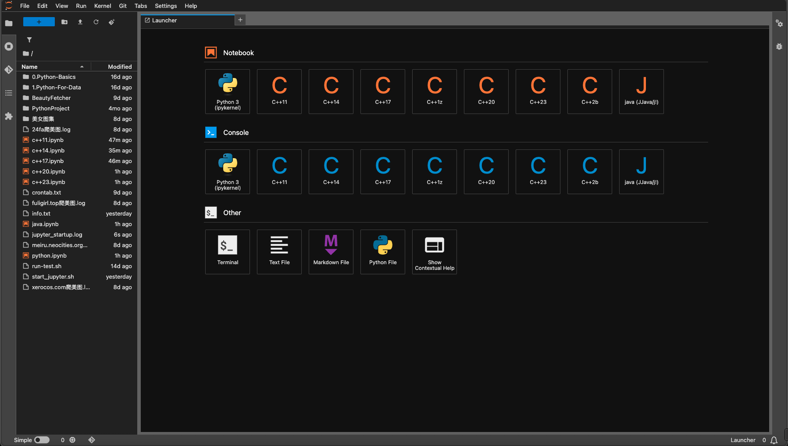

# docker-arch-pyenv-jupyter
pyenv 安装 jupyter notebook 封装特殊需求自用 python 测试容器  
和[docker-arch-miniforge-jupyter](https://github.com/469138946ba5fa/docker-arch-miniforge-jupyter)项目一样，本项目通过 Docker 构建了一个多内核 Jupyter 环境，集成了 Python、C++ 和 Java 的内核。项目基于 pyenv 构建，并通过自动化脚本完成各项配置（如 Jupyter 自动配置、默认密码、终端、主题等）。



    
<a href="https://star-history.com/#469138946ba5fa/docker-arch-pyenv-jupyter&Date">
  <picture>
    <source media="(prefers-color-scheme: dark)" srcset="https://api.star-history.com/svg?repos=469138946ba5fa/docker-arch-pyenv-jupyter&type=Date&theme=dark" />
    <source media="(prefers-color-scheme: light)" srcset="https://api.star-history.com/svg?repos=469138946ba5fa/docker-arch-pyenv-jupyter&type=Date" />
    
  </picture>
</a>

## 目录结构

项目工作目录如下：

```plaintext
.
├── .env.amd64                 # Docker Compose 配置文件所需 amd64 环境，需要更名为 .env 使用
├── .env.arm64                 # Docker Compose 配置文件所需 arm64 环境，需要更名为 .env 使用
├── docker-compose.yml         # Docker Compose 配置文件，用于多容器编排（例如搭配其它服务时使用）
├── Dockerfile                 # 构建 Docker 镜像的说明文件
├── LICENSE                    # 许可协议文件
├── README.md                  # 本项目说明文档
├── images                     # 图像目录，包含 README.md 说明所需图像
├── scripts                    # 脚本目录，包含各项自动化安装和启动脚本
│   ├── clean.sh               # 清理构建产物或停止容器的脚本
│   ├── common.sh              # 通用日志、函数等辅助脚本
│   ├── init_system.sh         # 系统初始化脚本（例如配置 locale、环境变量等）
│   ├── install_cling.sh       # 编译安装 cling 内核的脚本，用于创建 cpp 支持环境
│   ├── install_jbang.sh       # 安装 jbang（用于 Java 工具链）的脚本
│   ├── install_jdk.sh         # 安装 JDK 环境的脚本
│   ├── install_jupyter.sh     # 安装并配置 Jupyter（包括内核、密码、默认终端/主题）的脚本
│   ├── install_pyenv.sh       # 安装 pyenv 的脚本，用于创建 python 环境
│   └── start_jupyter.sh       # 启动 Jupyter 服务的脚本
└── sources                    # 资源目录，包含预构建包和编译所需源码离线压缩包
    └── .gitkeep               # 仅作为一个占位文件，帮助 Git 跟踪空目录的存在
```

## 特点

- **多语言支持**  
  - Python 内核  
  - C++ 内核：默认提供 C++11、C++14、C++17、 C++1z C++20 C++2b 内核，手动修改配置后可以扩展支持 C++23。  
  - Java 内核：通过 jbang 与 Java（jdk 25）部署相应内核。

- **自动化配置**  
  - 自动生成 Jupyter 配置文件（`jupyter_server_config.py`、用户覆盖设置），设置默认密码、默认终端（`/bin/bash`）及黑暗主题。  
  - 脚本化安装与构建，确保在非交互式 Docker 环境中稳定运行。

- **数据科学支持**  
  包含多个常用数据科学和开发工具包（例如 numpy、pandas、jupyter_contrib_nbextensions 等），以满足开发与实验需求。

## 快速入门

### 通过 docker-compose 文件启动（如果你在 docker-compose.yml 中配置了服务）：

根据你的系统cpu架构选择正确的环境文件比如 .env.arm64 修改完善后，改名为 .env 以支持 docker-compose.yml 文件

```bash
docker-compose up -d
```

### 通过 docker 启动 Jupyter 服务

项目中通过 `tini` 执行 `start_jupyter.sh` 启动 Jupyter 服务。你可以直接进入容器后执行脚本，或在 Docker Compose 设置中指定此命令。启动后，服务默认监听 8888 端口。

例如，通过 docker 运行容器：

```bash
docker run --rm -it -p 8888:8888 ghcr.io/469138946ba5fa/docker-arch-pyenv-jupyter:latest tini -- "/usr/local/bin/start_jupyter.sh"
```

### 访问 JupyterLab

在浏览器中打开 `http://localhost:8888`，按照 .env 配置文件中设置的密码或者 `123456` 登录。

### 密码修改
在浏览器中打开 `http://localhost:8888`，登陆，打开 `terminal` 终端
执行以下命令，并输入两次密码(不会显示字符)，重启容器完成密码修改
```shell
# 修改密码
jupyter notebook password
# 重启容器
docker-compose restart
```

### 测试内核

在 Jupyter Notebook 中，新建 Notebook 时，可以选择不同的内核（例如 Python Java C++11）。可将以下代码分别粘贴到不同内核 ipynb 页面的 cell 中测试：

- **Python 示例**

  ```python
  print('Hello, World! (Python)')
  word_str='af5ab649831964'
  word_str[::-1]
  ```

- **Java 示例**

  ```java
  System.out.println("Hello, World! (Java)");
  ```

在使用 C++ 内核时，需注意以下事项：

1. **清理内核以避免变量冲突报错**：
   - 频繁测试代码时，建议经常清理内核。
   - 重复执行同一个 cell 会导致变量名重复定义，因为 Jupyter 会存储这些变量。

2. **代码组织建议**：
   - 将不同功能的代码分离到不同的 cell 中按顺序执行。例如：
     - **头文件引用**：放入一个单独的 cell，仅需执行一次。
     - **变量定义**：放入一个单独的 cell，仅需执行一次。
     - **代码逻辑执行**：放入一个单独的 cell，可多次执行。

3. **使用独特变量名称**：尽量避免变量名重复，这是减少冲突的好习惯。

4. **解决报错的方法**：
   - 点击菜单中的 **"内核" -> "重新启动并清除输出"** 来清理之前定义的变量。
   - 然后重新运行需要的代码。

- **C++11 示例**

  ```cpp
  #include <iostream>
  #include <vector>
  #include <algorithm>

  std::vector<int> nums = {1, 2, 3, 4, 5};
  int sumOfSquares = 0;
  std::for_each(nums.begin(), nums.end(), [&sumOfSquares](int x) {
      sumOfSquares += x * x;
  });
  std::cout << "C++11: Sum of squares is " << sumOfSquares << std::endl;
  ```

- **C++14 示例**

  ```cpp
  #include <iostream>
  auto add = [](auto a, auto b) {
      return a + b;
  };
  std::cout << "C++14: 10 + 20 = " << add(10, 20) << std::endl;
  ```

- **C++17 示例**
  ```cpp
  #include <iostream>
  #include <tuple>

  std::tuple<int, double, std::string> data = {42, 3.14, "Hello C++17"};
  auto [num, pi, greeting] = data;
  std::cout << "C++17: " << num << ", " << pi << ", " << greeting << std::endl;
  ```

- **C++20 示例**

  ```cpp
  #include <iostream>
  #include <vector>
  #include <ranges>

  std::vector<int> v = {1, 2, 3, 4, 5};
  auto squares = v | std::views::transform([](int x) { return x * x; });
  std::cout << "C++20: Squares: ";
  for (auto s : squares) {
      std::cout << s << " ";
  }
  std::cout << std::endl;
  ```

- **C++23 示例**

  ```cpp
  #include <print>

  // 简单打印
  std::print("C++23: Welcome to C++23, {}!", "User");
  ```

## 已知问题与调试
- github 仓库 ghcr.io 推送一直不显示 docker 镜像标签信息☹️
- github 仓库 ghcr.io 推送 --output 导出器 type=oci-mediatypes=false 关闭OCI索引，然而失败了☹️
- 若 Jupyter 配置（密码、默认终端或主题）未生效，请检查容器启动日志中是否正确生成 `~/.jupyter` 下的配置文件。
- 容量太大，个人学习使用还可以，共享出来也少有人能用上，构建出这么大的镜像不如安装到本机

## 定制与扩展

- 如果你需要添加新的内核或者修改现有内核配置，请参考 `scripts/install_jupyter.sh` 中的自动化配置逻辑。  
- 更多配置项可参见 [Jupyter 官方文档](https://docs.jupyter.org/en/latest/index.html)，结合项目需求进行扩展。

## 构建 Docker 镜像

你可能需要一些前置条件，比如 docker compose buildx 环境的部署
稍微说一下吧，点到为止  
比如我的机器是 Ubuntu 24.04 LTS (GNU/Linux 6.8.0-57-generic aarch64)

  - **docker 部署过程如下：**

```shell
# 系统可以使用官方一键安装脚本 https://github.com/docker/docker-install
curl -fsSL https://test.docker.com -o test-docker.sh
sh test-docker.sh
# Manage Docker as a non-root user
## 非 root 用户需要加入到 docker 组才有权限使用
# Create the docker group
## 添加 docker 组
sudo groupadd docker
# Add your user to the docker group.
## 将当前用户加入到 docker 组权限
sudo usermod -aG docker ${USER}
# Log out and log back in so that your group membership is re-evaluated.
## 临时进入 docker 组测试，更好的方式是退出并重新登录测试
newgrp docker 
# Configure Docker to start on boot
# 启用 docker 开机自启动服务
sudo systemctl enable docker.service
sudo systemctl enable containerd.service
# satrt
# 开启 docker 服务，其实上一步就启用了
sudo systemctl start docker.service
sudo systemctl start containerd.service
# Verify that Docker Engine is installed correctly by running the hello-world image
# 测试 docker hello-world:latest 打印
docker run --rm hello-world:latest
```

  - **compose 部署更新过程如下：**

```shell
# GitHub 项目 URI
URI="docker/compose"

# 获取最新版本
VERSION=$(curl -sL "https://github.com/${URI}/releases" | grep -Eo '/releases/tag/[^"]+' | awk -F'/tag/' '{print $2}' | head -n 1)
echo "Latest version: ${VERSION}"

# 获取操作系统和架构信息
OS=$(uname -s)
ARCH=$(uname -m)

# 映射平台到官方命名
case "${OS}" in
  Linux)
    PLATFORM="linux"
    if [[ "${ARCH}" == "arm64" || "${ARCH}" == "aarch64" ]]; then
      ARCH="aarch64"
    elif [[ "${ARCH}" == "x86_64" ]]; then
      ARCH="x86_64"
    else
      echo "Unsupported architecture: ${ARCH}"
      echo 'should exit 1'
    fi
    ;;
  *)
    echo "Unsupported OS: ${OS}"
    echo 'should exit 1'
    ;;
esac

# 输出最终平台和架构
echo "Platform: ${PLATFORM}"
echo "Architecture: ${ARCH}"

# 拼接下载链接和校验码链接
TARGET_FILE="docker-compose-${PLATFORM}-${ARCH}"
SHA256_FILE="${TARGET_FILE}.sha256"
URI_DOWNLOAD="https://github.com/${URI}/releases/download/${VERSION}/${TARGET_FILE}"
URI_SHA256="https://github.com/${URI}/releases/download/${VERSION}/${SHA256_FILE}"
echo "Download URL: ${URI_DOWNLOAD}"
echo "SHA256 URL: ${URI_SHA256}"

# 检查文件是否存在
if [[ -f "/tmp/${TARGET_FILE}" ]]; then
  echo "File already exists: /tmp/${TARGET_FILE}"
  
  # 删除旧的 SHA256 文件（如果存在）
  if [[ -f "/tmp/${SHA256_FILE}" ]]; then
    echo "Removing old SHA256 file: /tmp/${SHA256_FILE}"
    rm -fv "/tmp/${SHA256_FILE}"
  fi

  # 下载新的 SHA256 文件
  echo "Downloading SHA256 file..."
  curl -L -C - --retry 3 --retry-delay 5 --progress-bar -o "/tmp/${SHA256_FILE}" "${URI_SHA256}"

  # 校验文件完整性
  # shasum 校验依赖 perl 可能 linux 系统需要手动安装
  echo "Verifying file integrity for /tmp/${TARGET_FILE}..."
  cd /tmp
  if ! shasum -a 256 -c "${SHA256_FILE}"; then
    log_warning "SHA256 checksum failed. Removing file and retrying..."
    rm -fv "/tmp/${TARGET_FILE}"
  else
    echo "File integrity verified successfully."
  fi
fi

# 如果文件不存在或之前校验失败
if [[ ! -f "/tmp/${TARGET_FILE}" ]]; then
  echo "Downloading file..."
  curl -L -C - --retry 3 --retry-delay 5 --progress-bar -o "/tmp/${TARGET_FILE}" "${URI_DOWNLOAD}"

  # 删除旧的 SHA256 文件并重新下载
  if [[ -f "/tmp/${SHA256_FILE}" ]]; then
    echo "Removing old SHA256 file: /tmp/${SHA256_FILE}"
    rm -fv "/tmp/${SHA256_FILE}"
  fi
  echo "Downloading SHA256 file..."
  curl -L --progress-bar -o "/tmp/${SHA256_FILE}" "${URI_SHA256}"

  # 校验完整性
  # shasum 校验依赖 perl 可能 linux 系统需要手动安装
  echo "Verifying file integrity for /tmp/${TARGET_FILE}..."
  cd /tmp
  if ! shasum -a 256 -c "${SHA256_FILE}"; then
    echo "Download failed: SHA256 checksum does not match."
    echo 'should exit 1'
  else
    echo "File integrity verified successfully."
  fi
fi

sudo mv -fv "/tmp/${TARGET_FILE}" /usr/local/bin/docker-compose
# Apply executable permissions to the binary
## 赋予执行权
sudo chmod -v +x /usr/local/bin/docker-compose
# create a symbolic link to /usr/libexec/docker/cli-plugins/
# 创建插件目录和软链接
sudo mkdir -pv /usr/libexec/docker/cli-plugins/
sudo ln -sfv /usr/local/bin/docker-compose /usr/libexec/docker/cli-plugins/docker-compose
# Test the installation.
## 测试版本打印
docker-compose version
docker compose version
```

  - **buildx 部署更新过程如下：**

```shell
# GitHub 项目 URI
URI="docker/buildx"

# 获取最新版本
VERSION=$(curl -sL "https://github.com/${URI}/releases" | grep -Eo '/releases/tag/[^"]+' | awk -F'/tag/' '{print $2}' | head -n 1)
echo "Latest version: ${VERSION}"

# 获取操作系统和架构信息
OS=$(uname -s)
ARCH=$(uname -m)

# 映射平台到官方命名
case "${OS}" in
  Linux)
    PLATFORM="linux"
    if [[ "${ARCH}" == "arm64" || "${ARCH}" == "aarch64" ]]; then
      ARCH="arm64"
    elif [[ "${ARCH}" == "x86_64" ]]; then
      ARCH="amd64"
    else
      echo "Unsupported architecture: ${ARCH}"
      echo 'should exit 1'
    fi
    ;;
  *)
    echo "Unsupported OS: ${OS}"
    echo 'should exit 1'
    ;;
esac

# 输出最终平台和架构
echo "Platform: ${PLATFORM}"
echo "Architecture: ${ARCH}"

# 拼接下载链接和校验码链接
TARGET_FILE="buildx-${VERSION}.${PLATFORM}-${ARCH}"
SHA256_FILE="${TARGET_FILE}.sbom.json"
URI_DOWNLOAD="https://github.com/${URI}/releases/download/${VERSION}/${TARGET_FILE}"
URI_SHA256="https://github.com/${URI}/releases/download/${VERSION}/${SHA256_FILE}"
echo "Download URL: ${URI_DOWNLOAD}"
echo "SHA256 URL: ${URI_SHA256}"

# 检查文件是否存在
if [[ -f "/tmp/${TARGET_FILE}" ]]; then
  echo "File already exists: /tmp/${TARGET_FILE}"
  
  # 删除旧的 SHA256 文件（如果存在）
  if [[ -f "/tmp/${SHA256_FILE}" ]]; then
    echo "Removing old SHA256 file: /tmp/${SHA256_FILE}"
    rm -fv "/tmp/${SHA256_FILE}"
  fi

  # 下载新的 SHA256 文件
  echo "Downloading SHA256 file..."
  curl -L -C - --retry 3 --retry-delay 5 --progress-bar -o "/tmp/${SHA256_FILE}" "${URI_SHA256}"
  # 提取校验码
  CHECKSUM=$(cat "/tmp/${SHA256_FILE}" | jq -r --arg filename "${TARGET_FILE}" '.subject[] | select(.name == $filename) | .digest.sha256')
  # 将校验码写入源文件
  echo "${CHECKSUM} *${TARGET_FILE}" > "/tmp/${SHA256_FILE}"
  echo "校验码 ${CHECKSUM} 已写入文件: /tmp/${SHA256_FILE}"

  # 校验文件完整性
  # shasum 校验依赖 perl 可能 linux 系统需要手动安装
  echo "Verifying file integrity for /tmp/${TARGET_FILE}..."
  cd /tmp
  if ! shasum -a 256 -c "${SHA256_FILE}"; then
    log_warning "SHA256 checksum failed. Removing file and retrying..."
    rm -fv "/tmp/${TARGET_FILE}"
  else
    echo "File integrity verified successfully."
  fi
fi

# 如果文件不存在或之前校验失败
if [[ ! -f "/tmp/${TARGET_FILE}" ]]; then
  echo "Downloading file..."
  curl -L -C - --retry 3 --retry-delay 5 --progress-bar -o "/tmp/${TARGET_FILE}" "${URI_DOWNLOAD}"

  # 删除旧的 SHA256 文件并重新下载
  if [[ -f "/tmp/${SHA256_FILE}" ]]; then
    echo "Removing old SHA256 file: /tmp/${SHA256_FILE}"
    rm -fv "/tmp/${SHA256_FILE}"
  fi
  echo "Downloading SHA256 file..."
  curl -L --progress-bar -o "/tmp/${SHA256_FILE}" "${URI_SHA256}"
  # 提取校验码
  CHECKSUM=$(cat "/tmp/${SHA256_FILE}" | jq -r --arg filename "${TARGET_FILE}" '.subject[] | select(.name == $filename) | .digest.sha256')
  # 将校验码写入源文件
  echo "${CHECKSUM} *${TARGET_FILE}" > "/tmp/${SHA256_FILE}"
  echo "校验码 ${CHECKSUM} 已写入文件: /tmp/${SHA256_FILE}"

  # 校验完整性
  # shasum 校验依赖 perl 可能 linux 系统需要手动安装
  echo "Verifying file integrity for /tmp/${TARGET_FILE}..."
  cd /tmp
  if ! shasum -a 256 -c "${SHA256_FILE}"; then
    echo "Download failed: SHA256 checksum does not match."
    echo 'should exit 1'
  else
    echo "File integrity verified successfully."
  fi
fi

sudo mv -fv "/tmp/${TARGET_FILE}" /usr/local/bin/docker-buildx
# Apply executable permissions to the binary
## 赋予执行权
sudo chmod -v +x /usr/local/bin/docker-buildx
# create a symbolic link to /usr/libexec/docker/cli-plugins/
# 创建插件目录和软链接
sudo mkdir -pv /usr/libexec/docker/cli-plugins/
sudo ln -sfv /usr/local/bin/docker-buildx /usr/libexec/docker/cli-plugins/docker-buildx
# Test the installation.
## 测试版本打印
docker-buildx version
docker buildx version
```

  - **docker buildx build 在项目目录下执行构建镜像具体流程命令 ：**

```shell
# docker proxy pull
## 配置 docker 代理，比如 http://192.168.255.253:7890
sudo mkdir -pv /etc/systemd/system/docker.service.d
cat << '469138946ba5fa' | sudo tee /etc/systemd/system/docker.service.d/http-proxy.conf
[Service]
Environment="HTTP_PROXY=http://192.168.255.253:7890"
Environment="HTTPS_PROXY=http://192.168.255.253:7890"
Environment="NO_PROXY=localhost,127.0.0.1,192.168.255.0/24"
469138946ba5fa
sudo systemctl daemon-reload
sudo systemctl restart docker
sudo systemctl show --property=Environment docker

# docker login & config
## 使用 github 具有上传下载镜像权限 [write:packages(read:packages)] 的 token 登陆 github 并预配置用户和目录参数
echo '请输入具有上传下载镜像权限 [write:packages(read:packages)] 的 github token (不会显示输入内容):' ; read -sr GITHUB_TOKEN
echo '请输入 github 用户名(为空则默认是 469138946ba5fa ):' ; read -r USERNAME
echo '请输入你的 github 镜像存储源(为空则默认是 ghcr.io ):' ; read -r DOCKER_DOMAIN
echo '请输入 docker 项目存放的父目录(为空则默认目录 /media/psf/KingStonSSD1T/docker-workspace ):' ; read -r CUSTOM_DIR
echo '请输入你的 docker 项目名(为空则默认是我的仓库名即 docker-arch-pyenv-jupyter ):' ; read -r REPO
echo '请输入你的 docker buildx 构建可能需要的大缓存存储目录(为空则默认目录 /media/psf/KingStonSSD1T/docker_buildx.cache ):' ; read -r BUILDX_CACHE

## 执行登陆和变量赋值解除
USERNAME=${USERNAME:-469138946ba5fa}
DOCKER_DOMAIN=${DOCKER_DOMAIN:-ghcr.io}
echo ${GITHUB_TOKEN} | docker login ${DOCKER_DOMAIN} -u ${USERNAME} --password-stdin ; unset GITHUB_TOKEN
CUSTOM_DIR=${CUSTOM_DIR:-'/media/psf/KingStonSSD1T/docker-workspace'}
REPO=${REPO:-docker-arch-pyenv-jupyter}
BUILDX_CACHE=${BUILDX_CACHE:-'/media/psf/KingStonSSD1T/docker_buildx.cache'}

## 创建缓存目录和新缓存目录
mkdir -pv ${BUILDX_CACHE}
mkdir -pv ${BUILDX_CACHE}-new
echo ${USERNAME}
echo ${DOCKER_DOMAIN}
echo ${CUSTOM_DIR}/${REPO}
echo ${BUILDX_CACHE}
echo ${BUILDX_CACHE}-new

## 进入到项目目录
cd ${CUSTOM_DIR}/${REPO}

# stop and remove containerd
## 停止并移除当前运行容器
docker-compose stop
docker-compose rm -fv

# delete image tag
## 删除当前镜像，如果需要可以解除注释粘贴执行
#docker rmi ${DOCKER_DOMAIN}/${USERNAME}/${REPO}:latest

# All emulators:
## 多架构跨平台环境虚拟
docker run --privileged --rm tonistiigi/binfmt:master --install all
# Show currently supported architectures and installed emulators
docker run --privileged --rm tonistiigi/binfmt:master

# docker buildx 
## 使用 docker buildx 构建单/多架构镜像
# buildx create
## 创建 buildx 构建节点并启用查看信息
#docker-buildx create --use
docker-buildx create --name ${REPO} --use
docker-buildx inspect --bootstrap

#  说明：
#  --platform linux/arm64/v8,linux/amd64 表示构建多个平台的镜像。
#  --tag 参数根据你自己的环境变量（例如 DOCKER_DOMAIN、USERNAME、REPO）设置镜像名称。
#  --no-cache 选项来避免使用过多的缓存，不要与 --cache-from 和 --cache-to 合用
#  --cache-from 从 ${BUILDX_CACHE} 目录中加载缓存数据，加速构建。
#  --cache-to 将新生成的缓存数据写入到 ${BUILDX_CACHE}-new 目录中。
#  --label 添加镜像标签应该和 Dockerfile 中的 LABEL 等效，但是推送一直不显示 docker 镜像标签信息☹️
#  --load 表示将构建完成的镜像加载到 Docker 本地镜像库中（对于跨平台构建，注意在某些情况下可能只能加载当前体系结构的镜像）。
#  --push 表示将构建完成的镜像推送到 Docker 远端镜像库中 
#  --output 导出器以下是type参数信息
#    type=image 导出类型为镜像
#    name=ghcr.io/469138946ba5fa/docker-arch-pyenv-jupyter:latest 镜像名
#    compression=zstd 压缩类型 zstd 也支持 gzip 和 estargz
#    compression-level=22 设置 zstd 压缩级别为 22 ，gzip 和 estargz 的范围是 0-9 ， zstd 的范围是 0-22
#    force-compression=true 强制重压缩
#  最近发现云端镜像仓库有 unknown/unknown 未识别架构的问题，如下方案可以规避云端仓库 https://github.com/docker/buildx/issues/1964#issuecomment-1644634461
#  --output 导出器 type=oci-mediatypes=false 关闭OCI索引，然而失败了☹️
#  --provenance=false 设置为不生成来源信息，但禁用 provenance 信息，意味着你失去了有关构建过程的详细记录和签名。这对追踪镜像的安全性和来源可能会有一些影响。
#  参考 https://docs.docker.com/build/building/variables/#buildx_no_default_attestations
#  export BUILDX_NO_DEFAULT_ATTESTATIONS=1 添加环境变量禁用来源证明应该和 --provenance=false 等效

# buildx build load
## 单架构本地存储，比如 linux/arm64/v8 ，压缩，去除oci索引
export BUILDX_NO_DEFAULT_ATTESTATIONS=1
docker-buildx build --platform linux/arm64/v8 \
  --cache-from type=local,src=${BUILDX_CACHE} \
  --cache-to type=local,dest=${BUILDX_CACHE}-new,mode=max \
  --label "org.opencontainers.image.description=Pyenv 安装 jupyter notebook 封装特殊需求自用 python 测试容器." \
  --label "org.opencontainers.image.title=Pyenv Jupyter" \
  --label "org.opencontainers.image.version=1.0.0" \
  --label "org.opencontainers.image.authors=469138946ba5fa <af5ab649831964@gmail.com>" \
  --label "org.opencontainers.image.source=https://github.com/469138946ba5fa/docker-arch-pyenv-jupyter" \
  --label "org.opencontainers.image.licenses=MIT" \
  --output type=image,name=${DOCKER_DOMAIN}/${USERNAME}/${REPO}:latest,compression=zstd,compression-level=22,force-compression=true,oci-mediatypes=false \
  --tag ${DOCKER_DOMAIN}/${USERNAME}/${REPO}:latest \
  --load .

# docker-compose test
## docker-compose 运行测试
docker-compose stop
docker-compose rm -fv
docker-compose up -d --force-recreate
## 容器日志 ctrl+c 退出
docker-compose logs -f
## 容器状态监控 ctrl+c 退出
docker-compose stats

# buildx build push
## 多架构上传仓库，比如 linux/arm64/v8,linux/amd64，去除oci索引，防止 unknown/unknown
## 正常构建镜像会很大，但是时间很短，上传会浪费大量带宽
export BUILDX_NO_DEFAULT_ATTESTATIONS=1
docker buildx build \
  --platform linux/arm64/v8,linux/amd64 \
  --label "org.opencontainers.image.description=pyenv 安装 jupyter notebook 封装特殊需求自用 python 测试容器." \
  --label "org.opencontainers.image.title=Pyenv Jupyter" \
  --label "org.opencontainers.image.version=1.0.0" \
  --label "org.opencontainers.image.authors=469138946ba5fa <af5ab649831964@gmail.com>" \
  --label "org.opencontainers.image.source=https://github.com/469138946ba5fa/docker-arch-pyenv-jupyter" \
  --label "org.opencontainers.image.licenses=MIT" \
  --cache-from type=local,src=${BUILDX_CACHE} \
  --cache-to type=local,dest=${BUILDX_CACHE}-new,mode=max \
  --output type=image,name=${DOCKER_DOMAIN}/${USERNAME}/${REPO}:latest,oci-mediatypes=false \
  --push .

## 或者多架构上传仓库，比如 linux/arm64/v8,linux/amd64，压缩并去除oci索引，防止 unknown/unknown
## 但压缩会意味着浪费更多的时间，但是也许会节省带宽，然而我并不清楚压缩和正常构建之间的关系
export BUILDX_NO_DEFAULT_ATTESTATIONS=1
docker buildx build \
  --platform linux/arm64/v8,linux/amd64 \
  --label "org.opencontainers.image.description=pyenv 安装 jupyter notebook 封装特殊需求自用 python 测试容器." \
  --label "org.opencontainers.image.title=Pyenv Jupyter" \
  --label "org.opencontainers.image.version=1.0.0" \
  --label "org.opencontainers.image.authors=469138946ba5fa <af5ab649831964@gmail.com>" \
  --label "org.opencontainers.image.source=https://github.com/469138946ba5fa/docker-arch-pyenv-jupyter" \
  --label "org.opencontainers.image.licenses=MIT" \
  --cache-from type=local,src=${BUILDX_CACHE} \
  --cache-to type=local,dest=${BUILDX_CACHE}-new,mode=max \
  --output type=image,name=${DOCKER_DOMAIN}/${USERNAME}/${REPO}:latest,compression=zstd,compression-level=22,force-compression=true,oci-mediatypes=false \
  --push .

## 或者多架构上传仓库，比如 linux/arm64/v8,linux/amd64，压缩，不生成镜像来源，防止 unknown/unknown
## 禁用 provenance 信息，意味着你失去了有关构建过程的详细记录和签名。这对追踪镜像的安全性和来源可能会有一些影响。
export BUILDX_NO_DEFAULT_ATTESTATIONS=1
docker buildx build \
  --platform linux/arm64/v8,linux/amd64 \
  --label "org.opencontainers.image.description=pyenv 安装 jupyter notebook 封装特殊需求自用 python 测试容器." \
  --label "org.opencontainers.image.title=Pyenv Jupyter" \
  --label "org.opencontainers.image.version=1.0.0" \
  --label "org.opencontainers.image.authors=469138946ba5fa <af5ab649831964@gmail.com>" \
  --label "org.opencontainers.image.source=https://github.com/469138946ba5fa/docker-arch-pyenv-jupyter" \
  --label "org.opencontainers.image.licenses=MIT" \
  --cache-from type=local,src=${BUILDX_CACHE} \
  --cache-to type=local,dest=${BUILDX_CACHE}-new,mode=max \
  --output type=image,name=${DOCKER_DOMAIN}/${USERNAME}/${REPO}:latest,compression=zstd,compression-level=22,force-compression=true \
  --provenance=false
  --push .

# 查看 Docker 镜像元数据信息
docker inspect ${DOCKER_DOMAIN}/${USERNAME}/${REPO}:latest
# 查看 Docker 镜像清单（Manifest）。JSON 格式 Docker 镜像清单包含了有关镜像的元数据，包括层（layers）、架构（architecture）、操作系统（OS）、标签（tags）等信息
docker manifest inspect ${DOCKER_DOMAIN}/${USERNAME}/${REPO}:latest
# 启用调试模式后，命令会输出更多的详细信息，包括 Docker 连接的网络请求、API 调用等
docker --debug manifest inspect ${DOCKER_DOMAIN}/${USERNAME}/${REPO}

# delete buildx cache dir
## 删除 docker buildx 所使用的大存储缓存目录，你也可以留着
rm -frv ${BUILDX_CACHE}

# create new buildx cache dir
## 使用  docker buildx 新的缓存替换旧缓存
mv -fv ${BUILDX_CACHE}-new ${BUILDX_CACHE}
mkdir -pv  ${BUILDX_CACHE}-new

# docker build clean
## 清理所有停止的容器
#docker container prune
## 清理未使用的卷
#docker volume prune
## 清理 buildx 构建缓存。以及清理构建新镜像所产生的 <none> 标签老镜像
docker builder prune -af
docker rmi $(docker images -qaf dangling=true)
#docker image prune -a
## 清理未使用的镜像
#docker image prune -a
## 清理所有不需要的数据: 如果想要彻底清理所有未使用的镜像、容器、网络和卷，可以使用
#docker system prune --all --volumes

## 清理所有未使用的镜像、容器、网络、构建缓存和卷。
#docker system prune --volumes

# buildx remove other node
## 清理 buildx 不使用的节点，你也可以留着
docker-buildx use default
docker-buildx ls
#docker-buildx rm -f --all-inactive
#docker-buildx rm -f $(docker-buildx ls --format '{{.Builder.Name}}')
docker-buildx stop ${REPO}
docker-buildx rm -f ${REPO}
docker-buildx ls
```

## 获取跨平台的预编译安装包
利用 docker 环境构建跨平台的预编译安装包流程：

  - **其实就是 script/init_system.sh script/install_cling.sh 和 script/start_jupyter.sh 脚本中从源码编译的部分代码组合实现**
  - **✅ 第一阶段：创建多架构容器，配置多容器跨平台支持环境，多架构容器测试编译流程防止产生错误**
```bash
# All emulators:
## 多架构跨平台环境虚拟
docker run --privileged --rm tonistiigi/binfmt:master --install all
# Show currently supported architectures and installed emulators
docker run --privileged --rm tonistiigi/binfmt:master

# arm64/v8 架构
docker run --rm \
  --name "test-arm64" \
  --platform "linux/arm64/v8" \
  --memory="8g" \
  -p "8888:8888" \
  -it ubuntu:rolling bash

# 或 amd64 架构
docker run --rm \
  --name "test-amd64" \
  --platform "linux/amd64" \
  --memory="8g" \
  -p "8888:8888" \
  -it ubuntu:rolling bash
```

  - **🧹 第二阶段：容器内配置 pyenv 并编译 python 安装 jupyter ，clone root-project/llvm-project 和 root-project/cling 源码编译测试 cling**

```bash
# 环境变量
export DEBIAN_FRONTEND=noninteractive \
  PIP_CHANNELS='https://pypi.org/simple' \
  PIP_CHANNELS="${PIP_CHANNELS:-https://pypi.org/simple}" \
  # 指定 cling 的 python 版本
  # 获取pyenv版本
  # 为空则返回最新稳定版，如 3.13.3
  # --latest-alpha 返回最新 alpha，如 3.14.0a7t
  # --latest-dev 返回最新 dev，如 3.14t-dev
  # --latest-t 返回最新 t，如 3.13.3t
  # 3.13.2t 如果存在就返回它，不存在则返回最新稳定版
  # 3.99.9 不存在，返回 fallback 稳定版
  PY_VERSION=3.12.10 \
  PY_ENV=py${PY_VERSION} \
  # 初始化 pyenv 环境
  PYENV_ROOT="${HOME}/.pyenv" \
  PATH="${PYENV_ROOT}/bin:${PYENV_ROOT}/versions/${PY_ENV}/bin:${PATH}" \
  SRC_DIR="/tmp" \
  INSTALL_PREFIX="/usr/local" \
  KERNEL_DIR="${INSTALL_PREFIX}/share/cling/Jupyter" \
  BUILD_DIR="${INSTALL_PREFIX}/share/cling/build" \
  # 默认不设置则用1/3的线程，防止系统崩溃大哭
  CORENUM=4 \
  CORENUM=${CORENUM:-$(($(nproc)/3))}

# 所需系统软件包列表（基础系统工具和常用工具）
packages=(
  apt-transport-https  # 允许 APT 使用 HTTPS 协议访问软件仓库，提高传输安全性
  ca-certificates      # 根证书包，用于验证 SSL/TLS 链接，确保 HTTPS 通信安全
  git               # 分布式版本控制系统，用于代码管理和拉取远程仓库
  build-essential   # 一组构建工具（如 gcc、make 等），用于编译编译 C/C++ 等语言的代码
  # 构建工具链核心三板斧
  cmake             # 读取源码中的 CMakeLists.txt 文件（类似于 Makefile）判断系统、依赖、编译器，生成真正用来编译的构建脚本
  ninja-build       # 吃 cmake 生成的 .ninja 文件来执行实际的编译任务，小巧又超级快的构建工具，比 make 快很多，适合大型 C++ 工程（比如 LLVM 和 Cling）
  curl              # 命令行 HTTP 请求工具，用于获取 URL 内容和进行网络调试
  # 🔐 安全 & 加密相关
  libssl-dev	      # 支持 ssl 模块，用于 HTTPS、TLS 加密，依赖 OpenSSL。
  libffi-dev	      # 提供调用外部 C 函数的能力，支持 ctypes 和某些 FFI 模块。
  libxmlsec1-dev	  # 用于 XML 加密、签名验证等高级安全操作（较少用，某些包可能用到）。
  # 📦 压缩 & 解压相关
  zlib1g-dev	      # 用于 zlib 模块，支持 .gz 格式压缩解压。
  libbz2-dev	      # 用于 bz2 模块，支持 .bz2 文件。
  liblzma-dev	      # 支持 .xz、.lzma 格式压缩（lzma 模块）。
  xz-utils	          # 提供 xz 命令行工具，也用于支持 lzma。
  # 🗃 数据库 & 存储支持
  libsqlite3-dev	  # 支持 sqlite3 模块，这是 Python 自带的轻量数据库。
  # 🧠 终端与交互支持
  libreadline-dev	  # 支持命令行输入历史、编辑等功能（REPL 中常用）。
  libncursesw5-dev	  # 提供彩色终端、光标控制支持（如 curses 模块）。
  # 🖼 图形界面支持（用于 tkinter）
  tk-dev	          # 支持 GUI 模块 tkinter，依赖 Tcl/Tk。
  # 📄 XML 支持
  libxml2-dev	      # 支持处理 XML 文档的 xml.etree.ElementTree、xml.dom 等模块。
)

# 更新 apt 并安装所需软件包
apt update

# 循环安装各软件包
for pkg in "${packages[@]}"; do
  echo "Installing package: ${pkg}"
  apt -y install --no-install-recommends "${pkg}" || { echo "Failed to install ${pkg} Should exit 1"; }
done
ln -fsv /usr/share/zoneinfo/Asia/Shanghai /etc/localtime
dpkg-reconfigure -f noninteractive tzdata
echo "System initialization completed."

# 安装 pyenv
curl https://pyenv.run | bash

# 更新 pyenv
cd ${PYENV_ROOT}/ && git pull && cd ${SRC_DIR}

echo "pyenv setup is complete."
pyenv --version

# 初始化 pyenv 环境
eval "$(pyenv init -)"
eval "$(pyenv virtualenv-init -)"

# 获取pyenv版本
# resolve_python_version	返回最新稳定版，如 3.13.3
# resolve_python_version --latest-alpha	返回最新 alpha，如 3.14.0a7t
# resolve_python_version --latest-dev	返回最新 dev，如 3.14t-dev
# resolve_python_version --latest-t	返回最新 t，如 3.13.3t
# resolve_python_version 3.13.2t	如果存在就返回它，不存在则返回最新稳定版
# resolve_python_version 3.99.9	不存在，返回 fallback 稳定版
resolve_python_version() {
  local version=""
  local mode="stable"

  # 参数解析
  for arg in "$@"; do
    case "${arg}" in
      --latest-dev) mode="dev" ;;
      --latest-alpha) mode="alpha" ;;
      --latest-t) mode="t" ;;
      --*) echo "Unknown option: ${arg}" >&2; return 1 ;;
      *) version="${arg}" ;;  # 不是 -- 开头就是版本
    esac
  done

  local list=$(pyenv install --list 2>/dev/null | sed 's/^[ \t]*//' | grep -E '^2|^3\.')

  # 如果用户指定了版本，且存在，直接返回该版本
  if [[ -n "${version}" ]] && echo "${list}" | grep -qx "${version}"; then
    echo "${version}"
    return 0
  fi

  # 回退逻辑
  local fallback=""
  # 过滤算法
  case "${mode}" in
    alpha)
      fallback=$(echo "${list}" | grep -E '\.[0-9]+a[0-9]+?$' | tail -n1)
      ;;
    dev)
      fallback=$(echo "${list}" | grep -E 'dev$' | tail -n1)
      ;;
    t)
      fallback=$(echo "${list}" | grep -E 't$' | tail -n1)
      ;;
    stable)
      fallback=$(echo "${list}" | grep -vE 'dev$|t$|a' | tail -n1)
      ;;
  esac

  echo "${fallback}"
}

# 编译指定版本 python
pyenv install -v -f $(resolve_python_version ${PY_VERSION})
# 刷新
pyenv rehash
# 当前版本检查
pyenv version
pyenv versions

# 获取安装好的 python 版本
#PY_VERSION=$(pyenv versions | sed 's/^[ \t]*//')
pyenv global ${PY_VERSION}
pyenv virtualenv ${PY_VERSION} ${PY_ENV}
pyenv global ${PY_ENV} ${PY_VERSION}
pyenv activate ${PY_ENV}

# python 虚拟环境检查
pyenv version
pyenv versions

# 所需软件包列表
packages=(
  # jupyter 类别：构建完整的 Jupyter 环境及扩展
  jupyterlab                     # 下一代 Jupyter 用户界面，支持交互式笔记本和代码
  notebook                       # 经典 Jupyter Notebook 应用
  voila                          # 可将 Jupyter 笔记本转换为独立的 Web 应用
  ipywidgets                     # 为笔记本提供交互式控件（HTML widgets）
  qtconsole                      # 基于 Qt 的 Jupyter 控制台，提供终端式界面
  jupyter_contrib_nbextensions   # 社区贡献的 Notebook 扩展集合，可增强功能
  jupyterlab-git                 # 在 JupyterLab 中集成 Git 版本控制功能
  jupyterlab-dash                # 允许在 JupyterLab 中嵌入和交互使用 Dash 应用
)

# 更新 pip 工具包
python -m pip install --no-cache-dir -v --upgrade pip --break-system-packages  -i ${PIP_CHANNELS}

# 循环安装各软件包
for pkg in "${packages[@]}"; do
  echo "Installing package: ${pkg}"
  python -m pip install --no-cache-dir -v "${pkg}" --break-system-packages  -i ${PIP_CHANNELS} || { echo "Failed to install ${pkg} Should exit 1"; }
done

echo "Jupyter setup is complete."
# jupyter --version
jupyter --version

# 克隆或解压离线 llvm-project 源代码
git clone https://github.com/root-project/llvm-project.git ${SRC_DIR}/llvm-project
  ## llvm-project 源码有 1.5g 左右，如果你 llvm-project clone 不下来
  ## 可以想办法通过其他途径下载压缩源码离线 llvm-project.tar.gz ，我有两种思路
  ## 思路1: 可以使用 google cloud terminal 内 clone 完整后压缩,相当于 google cloud terminal 是跳板机
  ##       再在 google cloud terminal 内搭建一个可以断点续传的 nginx 监听 8080 端口
  ##       google cloud terminal 官方提供 8080 端口转发预览，这样通过预览地址下载 llvm-project 压缩离线包
  ## 思路2: 或者也有其他方法比如借用 github action 或者 gitlab ci/cd clone 压缩后对压缩包拆包
  ##       每个包拆分50MB或者更小绕过github/gitlab仓库提交大小限制，然后再提交到自己的仓库
  ##       最后clone或者下载拆分包到本地，再合并为 llvm-project 压缩离线包
  ## 然后保持容器终端始终开启不要退出，开一个新的终端将压缩包转移到容器内
  ## 假设下载下来的源码压缩包路径是 /docker-workspace/docker-arch-pyenv-jupyter/sources/llvm-project.tar.gz
  ## 编译所需资源目录存放在 /tmp/
  ## 则执行以下命令将源码放进容器中命令如下
  # docker cp /docker-workspace/docker-arch-pyenv-jupyter/sources/llvm-project.tar.gz test-arm64:/tmp/
  ## 或者放进其他架构的容器里
  # docker cp /docker-workspace/docker-arch-pyenv-jupyter/sources/llvm-project.tar.gz test-amd64:/tmp/
  ## 最后回到容器终端，解压源码到 ${SRC_DIR}/ 形成 ${SRC_DIR}/llvm-project 路径即可
  # tar zxf ${SRC_DIR}/llvm-project.tar.gz -C ${SRC_DIR}
  ## 使用 git 添加目录为全局安全
  # git config --global --add safe.directory ${SRC_DIR}/llvm-project
  ## 更新一下源码
  # git -C ${SRC_DIR}/llvm-project pull
# 选择特定分支
git -C ${SRC_DIR}/llvm-project checkout cling-latest
# 克隆 cling 源码
git clone https://github.com/root-project/cling.git ${SRC_DIR}/cling

# 创建编译目录，并保留，这或许会让镜像增大1G左右，我别无选择，唉😮‍💨
mkdir -pv ${BUILD_DIR}

# 构建直接输出到 ${BUILD_DIR}
cmake -G Ninja -B"${BUILD_DIR}" -S"${SRC_DIR}/llvm-project/llvm" \
  -DLLVM_EXTERNAL_PROJECTS="cling" \
  -DLLVM_EXTERNAL_CLING_SOURCE_DIR="${SRC_DIR}/cling/" \
  -DLLVM_ENABLE_PROJECTS="clang" \
  -DLLVM_TARGETS_TO_BUILD="host;NVPTX" \
  -DCMAKE_BUILD_TYPE=Release

cmake --build "${BUILD_DIR}" --target clang cling -- -j${CORENUM}
cmake --build "${BUILD_DIR}" --target libclingJupyter -- -j${CORENUM}
cmake --build "${BUILD_DIR}" -- -j${CORENUM}

# 安装
cmake --install "${BUILD_DIR}"

# 测试打印，如果输出 Hello World! 就算成功
/usr/local/bin/cling '#include <stdio.h>' 'printf("Hello World!\n");'

# 测试注册内核
echo "安装 Cling Jupyter 内核..."
# 创建内核目录
mkdir -pv ${KERNEL_DIR}
if [[ ! -d "${SRC_DIR}/cling/tools/Jupyter/kernel" ]]; then
  echo "缺失 cling 源码目录，无法注册 Jupyter 内核 Should exit 1"
fi

cp -afv "${SRC_DIR}/cling/tools/Jupyter/kernel" "${KERNEL_DIR}"

pushd "${KERNEL_DIR}/kernel" > /dev/null
cp -afv cling-cpp20 cling-cpp23
sed -i 's/20/23/g' cling-cpp23/kernel.json

python -m pip install -e .

for k in cling-cpp*/; do
  echo "注册 Jupyter 内核：${k}"
  jupyter-kernelspec install "${k}" ${JUPYTER_KERNEL_USER}
done
popd > /dev/null

# 检查注册内核列表
jupyter-kernelspec list

# 接下来启动 jupyter notebook 测试代码是否支持 C++
# 执行以下代码，可以看到类似这样的打印，后面的 token 可以用于登陆 http://127.0.0.1:8888/lab?token=6cf53428b5f2656f90733c032d0b7b83b13b129bbdcf122d
# 容器端口映射为 8888 ,则浏览器访问 http://127.0.0.1:8888 (或者你的局域网 http://IP:8888) 输入 token 登陆测试
jupyter-lab --allow-root --no-browser --notebook-dir=/tmp --ip=0.0.0.0 --port=8888
```

  - **测试代码是否支持 c++ 代码使用，测试完成后，返回容器终端按两次快捷键 Ctrl+C 即可退出 jupyter 服务**
  - **在 jupyter notebook 界面选择 Notebook c++11 输入代码如下，如果打印 C++11: Value stored in unique_ptr: 42 则成功**
  - **占用2个cell**
```c++11
#include <iostream>
#include <memory>

auto ptr = std::unique_ptr<int>(new int(42));
std::cout << "C++11: Value stored in unique_ptr: " << *ptr << std::endl;
```

  - **在 jupyter notebook 界面选择 Notebook c++14 输入代码如下，如果打印 元素的平方 则成功**
  - **占用2个cell**
    ```plaintext
    calculate_square of 1 is 1
    calculate_square of 2 is 4
    calculate_square of 3 is 9
    calculate_square of 4 is 16
    calculate_square of 5 is 25
    ```
```cpp
#include <iostream>
#include <vector>

// 使用泛型 Lambda 计算元素的平方
auto calculate_square = [](auto x) { return x * x; };
std::vector<int> numbers = {1, 2, 3, 4, 5};
for (int num : numbers) {
    std::cout << "calculate_square of " << num << " is " << calculate_square(num) << std::endl;
}
```

  - **在 jupyter notebook 界面选择 Notebook c++17 输入代码如下，如果打印 C++17: Value is 42 则成功**
  - **占用2个cell**
```cpp
#include <iostream>
#include <optional>

std::optional<int> getValue(bool condition) {
    return condition ? std::optional<int>(42) : std::nullopt;
}
auto result = getValue(true);
if (result) {
    std::cout << "C++17: Value is " << *result << std::endl;
} else {
    std::cout << "C++17: No value returned" << std::endl;
}
```

  - **在 jupyter notebook 界面选择 Notebook c++20 输入代码如下，如果打印 2 4 则成功**
  - **占用2个cell**
```cpp
#include <iostream>
#include <vector>

// 筛选偶数
std::vector<int> nums = {1, 2, 3, 4, 5};
std::vector<int> even;
for (int n : nums) {
    if (n % 2 == 0) {
        even.push_back(n);
    }
}

for (int n : even) {
    std::cout << n << " ";
}
std::cout << std::endl;
```

  - **在 jupyter notebook 界面选择 Notebook c++23 输入代码如下，如果打印 C++23: Welcome to C++23, User! 则成功**
  - **占用2个cell**
```cpp
#include <print>

// 简单打印
std::print("C++23: Welcome to C++23, {}!", "User");
```

  - **测试在 jupyter notebook 界面选择 Console REPL 交互代码如下，如果打印 Hello World! 则成功**
  - **先后传入2个cell交互代码**
```cpp
#include <stdio.h>

// 简单打印
printf("Hello World!\n");
```

  - **📦 第三阶段：测试完成没问题后容器内打包后提取**
  - **只需压缩 `${BUILD_DIR}` 这样在其他平台只需要配合 llvm-project 源码执行安装**
  - **省去编译时间，cling 就能用了，几乎零成本，成本都被我吃了，可不就零成本**
```bash
cd ${BUILD_DIR}/../
tar zcvf ${SRC_DIR}/llvm-clang-cling-build-$(uname -m).tar.gz build
```

  - **保持容器运行，然后打开新的终端**
  - **当前容器假设是 aarch64 架构容器名是 test-arm64**
  - **压缩包 llvm-clang-cling-build-$(uname -m).tar.gz 生成位置是在容器的 /tmp 目录**
  - **主机本地目录是 /docker-workspace/docker-arch-pyenv-jupyter/sources/**
  - **那么执行以下命令就可以根据容器架构从中拿出对应架构的预编译压缩包到本地目录**
```bash
docker cp test-arm64:/tmp/llvm-clang-cling-build-$(docker exec test-arm64 uname -m).tar.gz /docker-workspace/docker-arch-pyenv-jupyter/sources/
```
  - **然后在新的终端页面终止容器，容器会自动删除**
  - **至此预编译包 llvm-clang-cling-build-<arch>.tar.gz 获取完成，再配合官方 llvm-project 源码，即可在容器中完成快速安装，节省大量时间**
```shell
# 关闭arm64架构容器
docker stop test-arm64
# 或关闭其他架构容器
docker stop test-amd64
```

## 起因与内心：
  > 继[docker-arch-miniforge-jupyter](https://github.com/469138946ba5fa/docker-arch-miniforge-jupyter)项目的完成，想起曾有网友推荐`pyenv`编译安装`python`，额`TA`的名字忘记了，想不起来了
  >
  > 于是我就大脑一热觉得这是个好主意，但小脑不是很认同，于是我任性了一把👍任由它萎缩，就开发了这个`docker-arch-pyenv-jupyter`，查询了大量文档，也测试了各种编译版本
  >
  > 这里需要感谢[root-project](https://github.com/root-project)特别修改的llvm+clang+cling项目，这才让`pyenv`上安装的`jupyter`能够支持`c++`内核
  >
  > 也感谢[cmake](https://cmake.org/)、[ninja](https://ninja-build.org/)和[clang](https://clang.llvm.org/get_started.html)编译三剑客加速并增量编译了cling的工作，让我省了不少测试的时间
  >
  > 关于过去，我一直没能释怀，那些糟糕的烂人成了我痛苦回忆的一部分，一直让我痛苦，很痛苦，我无法原谅那些人，我一辈子也原谅不了，也不知道要到什么时候才能解脱 =_= 😮‍💨

## 许可证
本项目采用 [MIT License](LICENSE) 许可。

## 联系与反馈
遇到问题或有改进建议，请在 [issues](https://github.com/469138946ba5fa/docker-arch-pyenv-jupyter/issues) 中提出，或直接联系项目维护者。

## 参考
[ubuntu install docker](https://docs.docker.com/engine/install/ubuntu/)  
[docker-install](https://github.com/docker/docker-install)  
[docker buildx](https://docs.docker.com/build/builders/)  
[docker buildx output](https://docs.docker.com/build/exporters/#export-filesystem)  
[buildx_no_default_attestations](https://docs.docker.com/build/building/variables/#buildx_no_default_attestations)  
[docker compose](https://docs.docker.com/compose/install/linux/)  
[github docker buildx](https://github.com/docker/buildx)  
[github docker compose](https://github.com/docker/compose)  
[docker proxy pull](https://docs.docker.com/engine/daemon/proxy/)  
[jupyterlab](https://jupyterlab.readthedocs.io/en/latest/#)  
[pyenv](https://github.com/pyenv/pyenv)  
[pyenv-installer](https://github.com/pyenv/pyenv-installer)  
[shell environment for Pyenv](https://github.com/pyenv/pyenv#b-set-up-your-shell-environment-for-pyenv)  
[pyenv build install Python dependencies](https://github.com/pyenv/pyenv/wiki#suggested-build-environment)  
[tensorflow](https://www.tensorflow.org/)  
[wiki tensorflow](https://en.wikipedia.org/wiki/TensorFlow)  
[cmake](https://cmake.org/)  
[ninja](https://ninja-build.org/)  
[clang](https://clang.llvm.org/get_started.html)  
[llvm](https://github.com/root-project/llvm-project/tree/cling-latest)  
[cling](https://github.com/root-project/cling)  
[ERROR in cling::CIFactory::createCI(): esource directory lib/clang/? not found!](https://github.com/root-project/cling/issues/536)  
[install-cling-with-jupyter-support.md](https://gist.github.com/OChicken/09b4b4bbc9d6d6e336844a69b65ba9b3)  
[jbang](https://www.jbang.dev/)  
[openjdk](https://adoptium.net/)  

## 声明
本项目仅作学习交流使用，学习各种姿势，不做任何违法行为。仅供交流学习使用，出现违法问题我负责不了，我也没能力负责，我没工作，也没收入，年纪也大了，就算灭了我也没用，我也没能力负责。